 <link rel="stylesheet" href="../../style.css">
 <link rel = "stylesheet" href = "factionSource.css">
# Abyssal Demons #
 
Commanders
Min: 1 Max: 1

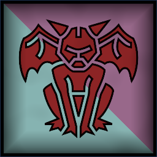
 Large Monster

Abyssal Prince

 
DemonicNever fails Discipline tests, loses D3 wounds on lost combat.
, 
FlyingFly Speed 20. Ignore Terrain.
, Spellcaster(2), Magic Weapon/Item, 
Lord of DecayOnce per battle, all friendly units with Gift of Decay restore D3 Wounds.
 or 
Lord of TrickeryOnce per battle, all friendly units with Gift of Trickery gain +3 move speed and Cover for one turn.
 or 
Lord Of WarOnce per battle, all friendly units with Gift of War gain Deadly Strikes (2x Wounds caused).
 

                

                 
5
5 
4
5
5
10
Skill
Power
Defense
Attacks
Wounds
Discipline

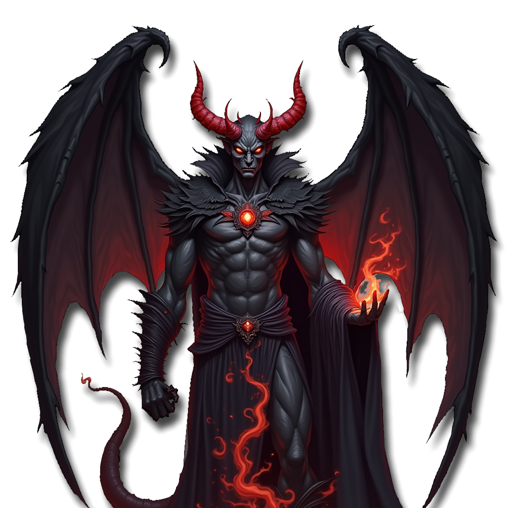

 <b> Cost:</b > 150 pts 

<b>Spell Options: </b> Shadow Bolt, Arcane Web, Frost Ward, Hex Of Ruin, Shroud, Plague, Blood Frenzy

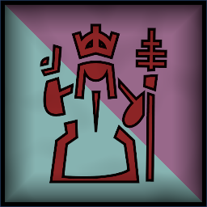
 Infantry

Abyssal Herald

 
Hand Weapon and Shield+1 Defense. Charge Bonus: +1 Power
 or 
Greatweapon (5 pts)+1 Power. Charge Bonus: +1 Power.
 or 
Two Hand Weapons (5 pts)+1 Attack
, Magic Weapon/Item, 
DemonicNever fails Discipline tests, loses D3 wounds on lost combat.
, 
Abyssal Armor+1 to Damage Saves
, 
Lord of DecayOnce per battle, all friendly units with Gift of Decay restore D3 Wounds.
 or 
Lord of TrickeryOnce per battle, all friendly units with Gift of Trickery gain +3 move speed and Cover for one turn.
 or 
Lord Of WarOnce per battle, all friendly units with Gift of War gain Deadly Strikes (2x Wounds caused).
 

                

                 
5
4 
4
3
3
10
Skill
Power
Defense
Attacks
Wounds
Discipline

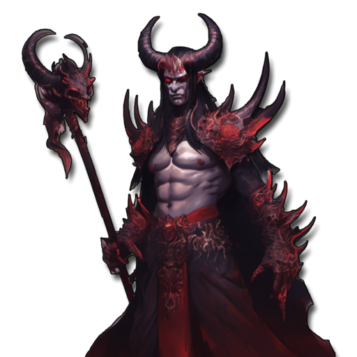

 <b> Cost:</b > 55 pts 

<b>Retinue Options: </b> Devil Spawn, Plague Walkers, Abyssal Reapers, Plague Flies

 
Battle Line
Min: 1 Max: 3

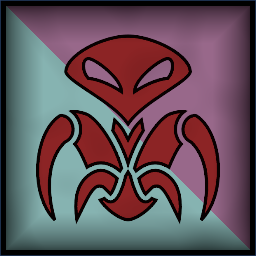
 Infantry Large

Abyssal Vipers

 
ClawsCharge Bonus: +1 Power
, Magic Banner (up to 100pts), 
DemonicNever fails Discipline tests, loses D3 wounds on lost combat.
, 
Gift Of TrickeryFavoured by Trickery. Unit has Ambush Deployment and +1 Move Speed
 

                

                 
5
4 
3
2
1
10
Skill
Power
Defense
Attacks
Wounds
Discipline

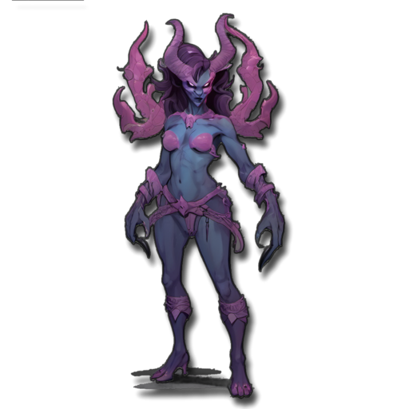

 <b> Cost per Model:</b > 12 pts 
 <b> Unit Size: </b>: 10-15 

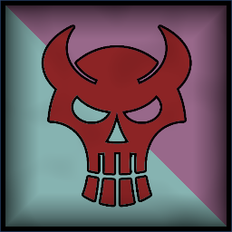
 Infantry Large

Devilspawn

 
Greatweapon+1 Power. Charge Bonus: +1 Power.
, Magic Banner (up to 100pts), 
DemonicNever fails Discipline tests, loses D3 wounds on lost combat.
, 
Gift Of WarFavoured by War. Unit has Frenzy (re-roll failed Attack Rolls in the first round of combat).
 

                

                 
4
4 
4
2
1
10
Skill
Power
Defense
Attacks
Wounds
Discipline

 <b> Cost per Model:</b > 14 pts 
 <b> Unit Size: </b>: 6-10 

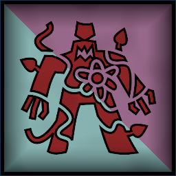
 Infantry Large

Plague Walkers

 
FangsCharge Bonus: +1 Power
, 
DemonicNever fails Discipline tests, loses D3 wounds on lost combat.
, 
Gift Of DecayFavoured by Decay. +1 Wounds. -1 Move Speed.
, Magic Banner (up to 50pts), 
PlagueTarget unit has -1 Skill and -1 Move Speed. Lasts until end of battle.
 

                

                 
2
3 
4
1
1
10
Skill
Power
Defense
Attacks
Wounds
Discipline

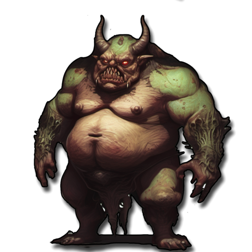

 <b> Cost per Model:</b > 9 pts 
 <b> Unit Size: </b>: 10-21 

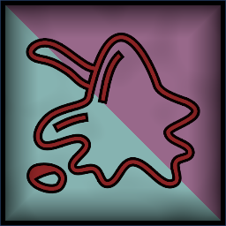
 Swarm

Plaguelings

 
FangsCharge Bonus: +1 Power
, 
DemonicNever fails Discipline tests, loses D3 wounds on lost combat.
, 
Gift Of DecayFavoured by Decay. +1 Wounds. -1 Move Speed.
 

                

                 
2
2 
3
5
5
10
Skill
Power
Defense
Attacks
Wounds
Discipline

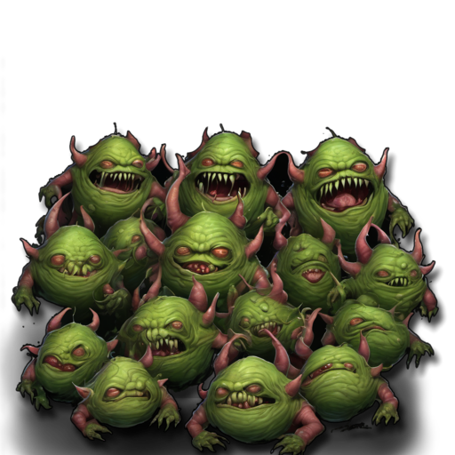

 <b> Cost per Model:</b > 27 pts 
 <b> Unit Size: </b>: 3-4 <b> Max Count: </b>: 1 

 
Ranged Support
Min: 0 Max: 1

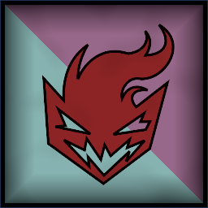
 Infantry Large

Fire Devils

 
FlamerRange 12. D3 Power 4.
, 
DemonicNever fails Discipline tests, loses D3 wounds on lost combat.
, Magic Banner (up to 50pts), 
Phase OutActivate for +4 Movement and Flying for one turn.
 

                

                 
3
4 
3
1
2
10
Skill
Power
Defense
Attacks
Wounds
Discipline

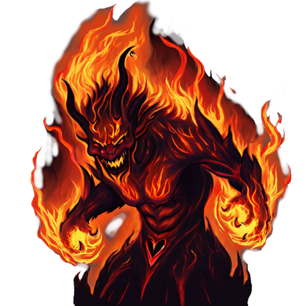

 <b> Cost per Model:</b > 15 pts 
 <b> Unit Size: </b>: 5-6 

 
Fast Attack
Min: 0 Max: 1

 Monstrous Infantry

Plague Flies

 
FangsCharge Bonus: +1 Power
, 
FlyingFly Speed 20. Ignore Terrain.
, 
Gift Of DecayFavoured by Decay. +1 Wounds. -1 Move Speed.
, 
DemonicNever fails Discipline tests, loses D3 wounds on lost combat.
 

                

                 
2
3 
3
2
3
10
Skill
Power
Defense
Attacks
Wounds
Discipline

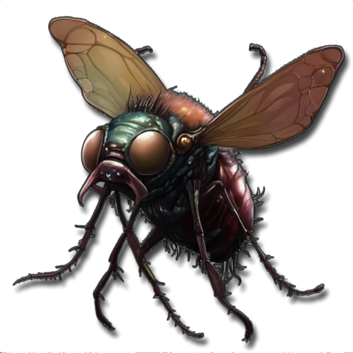

 <b> Cost per Model:</b > 22 pts 
 <b> Unit Size: </b>: 3-4 

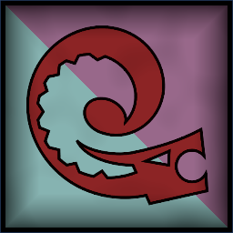
 Cavalry

Abyssal Reapers

 
ClawsCharge Bonus: +1 Power
, 
Gift Of TrickeryFavoured by Trickery. Unit has Ambush Deployment and +1 Move Speed
, 
DemonicNever fails Discipline tests, loses D3 wounds on lost combat.
, Magic Banner (up to 100pts) 

                

                 
5
4 
3
3
2
10
Skill
Power
Defense
Attacks
Wounds
Discipline

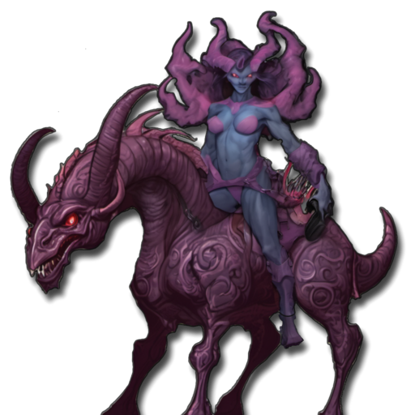

 <b> Cost per Model:</b > 26 pts 
 <b> Unit Size: </b>: 5-10 

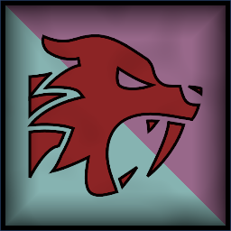
 Cavalry

Demonic Hounds

 
FangsCharge Bonus: +1 Power
, 
DemonicNever fails Discipline tests, loses D3 wounds on lost combat.
 

                

                 
3
4 
3
2
1
6
Skill
Power
Defense
Attacks
Wounds
Discipline

 <b> Cost per Model:</b > 11 pts 
 <b> Unit Size: </b>: 5 <b> Max Count: </b>: 2 

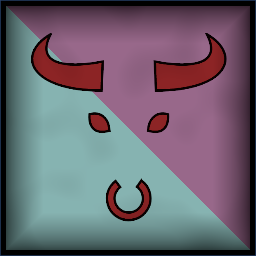
 Cavalry

Hell Riders

 
Greatweapon+1 Power. Charge Bonus: +1 Power.
, 
DemonicNever fails Discipline tests, loses D3 wounds on lost combat.
, Magic Banner (up to 100pts), 
Gift Of WarFavoured by War. Unit has Frenzy (re-roll failed Attack Rolls in the first round of combat).
 

                

                 
4
4 
4
3
2
10
Skill
Power
Defense
Attacks
Wounds
Discipline

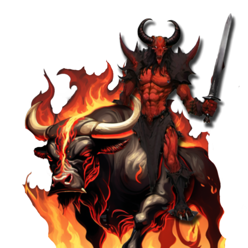

 <b> Cost per Model:</b > 28 pts 
 <b> Unit Size: </b>: 5-10 

 
Abyssal Terrors
Min: 0 Max: 1

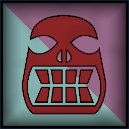
 Large Monster

Plague Hulk

 
Greatweapon+1 Power. Charge Bonus: +1 Power.
, 
DemonicNever fails Discipline tests, loses D3 wounds on lost combat.
, 
Gift Of DecayFavoured by Decay. +1 Wounds. -1 Move Speed.
, Spellcaster(0) 

                

                 
3
5 
5
5
8
10
Skill
Power
Defense
Attacks
Wounds
Discipline

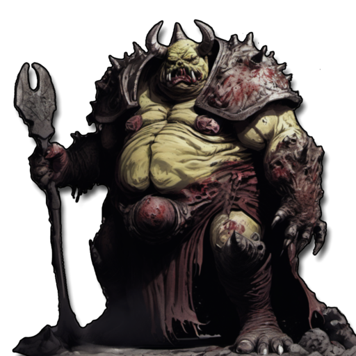

 <b> Cost per Model:</b > 110 pts 
 <b> Unit Size: </b>: 1 <b> Max Count: </b>: 1 

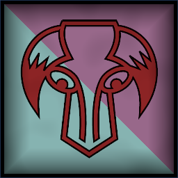
 Large Monster

Archdevil

 
Greatweapon+1 Power. Charge Bonus: +1 Power.
 or 
Two Hand Weapons+1 Attack
, 
DemonicNever fails Discipline tests, loses D3 wounds on lost combat.
, 
Gift Of WarFavoured by War. Unit has Frenzy (re-roll failed Attack Rolls in the first round of combat).
, 
FlyingFly Speed 20. Ignore Terrain.
 

                

                 
5
5 
5
6
6
10
Skill
Power
Defense
Attacks
Wounds
Discipline

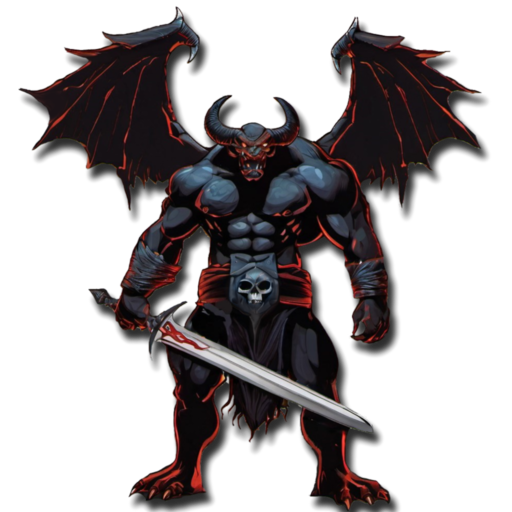

 <b> Cost per Model:</b > 150 pts 
 <b> Unit Size: </b>: 1 <b> Max Count: </b>: 1 

