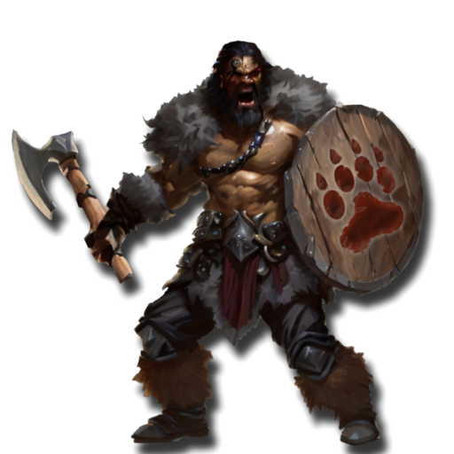
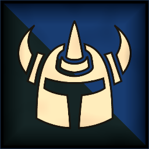
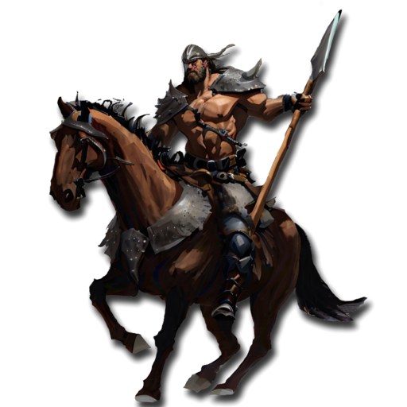
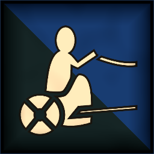
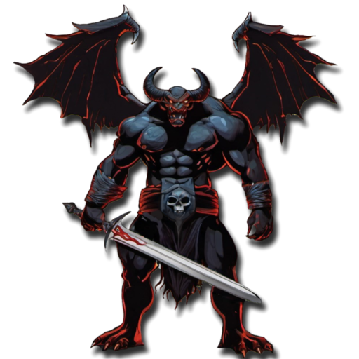
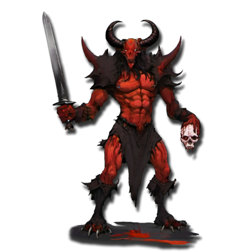

 <link rel="stylesheet" href="../../style.css">
 <link rel = "stylesheet" href = "factionSource.css">
# Abyssal Legions #
 
Commanders
Min: 1 Max: 1

 Infantry

Abyssal Champion

 
Hand Weapon and Shield (5 pts)+1 Defense. Charge Bonus: +1 Power
 or 
Greatweapon (10 pts)+1 Power. Charge Bonus: +1 Power.
 or 
Two Hand Weapons (10 pts)+1 Attack
, 
Abyssal Armor-1 Movement.  +1 to Damage Saves
, 
Demonic PossessionActivate once per battle. +3 Attacks, -3 Skill this turn.
, Magic Weapon/Item 

                

                 
5
4 
4
3
3
9
Skill
Power
Defense
Attacks
Wounds
Discipline

 <b> Cost:</b > 60 pts 

<b>Retinue Options: </b> Northmen Axe, Abyssal Warriors, Abyssal Knights, Abyssal Chariot, Manticore, Abyssal Dragon

 Infantry

Abyssal Sorcerer

 
Abyssal Armor-1 Movement.  +1 to Damage Saves
, Magic Item, Spellcaster(2) 

                

                 
4
4 
4
2
3
8
Skill
Power
Defense
Attacks
Wounds
Discipline

 <b> Cost:</b > 50 pts 

<b>Retinue Options: </b> Northmen Axe, Northmen Horse, Abyssal Warriors, Abyssal Knights, Abyssal Chariot, Manticore, Abyssal Dragon
<b>Spell Options: </b> Shadow Bolt, Fireball, Hex Of Ruin, Arcane Web

 
Mounts

 Large Monster

Abyssal Dragon

 
FangsCharge Bonus: +1 Power
, 
Fire BreathRange 12. 2D3 Power 5.
, 
FlyingFly Speed 20. Ignore Terrain.
 

                

                 
5
6 
5
5
7
9
Skill
Power
Defense
Attacks
Wounds
Discipline

 <b> Cost per Model:</b > 150 pts 
 <b> Unit Size: </b>: 1 

 Monstrous Infantry

Manticore

 
ClawsCharge Bonus: +1 Power
, 
FlyingFly Speed 20. Ignore Terrain.
 

                

                 
4
5 
5
4
5
8
Skill
Power
Defense
Attacks
Wounds
Discipline

 <b> Cost per Model:</b > 65 pts 
 <b> Unit Size: </b>: 1 

 
Battle Line
Min: 1 Max: 3

 Infantry

Northmen Axe

 
Hand Weapon and Shield+1 Defense. Charge Bonus: +1 Power
 or 
Two Hand Weapons (1 pts)+1 Attack
, Magic Banner (up to 50pts) 

                

                 
3
3 
3
1
1
7
Skill
Power
Defense
Attacks
Wounds
Discipline

 <b> Cost per Model:</b > 6 pts 
 <b> Unit Size: </b>: 10-25 

 Infantry Large

Abyssal Warriors

 
Hand Weapon and Shield+1 Defense. Charge Bonus: +1 Power
 or 
HalberdDamage Saves against this weapon are never better than 4+.
 or 
Greatweapon (1 pts)+1 Power. Charge Bonus: +1 Power.
 or 
Two Hand Weapons (1 pts)+1 Attack
, 
Abyssal Armor-1 Movement.  +1 to Damage Saves
, Magic Banner (up to 100pts) 

                

                 
4
4 
4
2
1
8
Skill
Power
Defense
Attacks
Wounds
Discipline

 <b> Cost per Model:</b > 16 pts 
 <b> Unit Size: </b>: 10-21 

 Monstrous Infantry

Dragon Spawn

 
HalberdDamage Saves against this weapon are never better than 4+.
 or 
Two Hand Weapons+1 Attack
 or 
Greatweapon+1 Power. Charge Bonus: +1 Power.
, 
Scaly Skin-1 Movement. +1 Defense
 

                

                 
4
4 
4
3
4
8
Skill
Power
Defense
Attacks
Wounds
Discipline

 <b> Cost per Model:</b > 50 pts 
 <b> Unit Size: </b>: 3-4 <b> Max Count: </b>: 1 

 
Fast Attack
Min: 0 Max: 2

 Cavalry

Northmen Horse

 
Hand Weapon and Shield+1 Defense. Charge Bonus: +1 Power
, Magic Banner (up to 50pts) 

                

                 
3
3 
3
2
2
7
Skill
Power
Defense
Attacks
Wounds
Discipline

 <b> Cost per Model:</b > 16 pts 
 <b> Unit Size: </b>: 5-10 

 Cavalry

Abyssal Knights

 
Hand Weapon and Shield+1 Defense. Charge Bonus: +1 Power
 or 
Greatweapon (3 pts)+1 Power. Charge Bonus: +1 Power.
, 
Abyssal Armor-1 Movement.  +1 to Damage Saves
, Magic Banner (up to 100pts) 

                

                 
4
4 
4
3
2
9
Skill
Power
Defense
Attacks
Wounds
Discipline

 <b> Cost per Model:</b > 35 pts 
 <b> Unit Size: </b>: 5 

 Cavalry

Abyssal Hounds

 
FangsCharge Bonus: +1 Power
 

                

                 
3
4 
3
2
1
6
Skill
Power
Defense
Attacks
Wounds
Discipline

 <b> Cost per Model:</b > 10 pts 
 <b> Unit Size: </b>: 5 <b> Max Count: </b>: 2 

 Chariot

Abyssal Chariot

 
Hand WeaponCharge Bonus: +1 Power
, 
Crushing ChargeCharge Bonus: +2 Power +2 Attacks
 

                

                 
4
4 
5
3
5
8
Skill
Power
Defense
Attacks
Wounds
Discipline

 <b> Cost per Model:</b > 65 pts 
 <b> Unit Size: </b>: 1 <b> Max Count: </b>: 1 

 
Demonic Allies
Min: 0 Max: 1

 Large Monster

Arch Devil

 
Greatweapon+1 Power. Charge Bonus: +1 Power.
 or 
Two Hand Weapons+1 Attack
, 
FearlessIgnores all penalties to Discipline tests.
, 
FrenzyRe-roll missed Attack Rolls in the first round of combat.
, 
FlyingFly Speed 20. Ignore Terrain.
 

                

                 
5
5 
5
6
6
10
Skill
Power
Defense
Attacks
Wounds
Discipline

 <b> Cost per Model:</b > 150 pts 
 <b> Unit Size: </b>: 1 <b> Max Count: </b>: 1 

 Infantry Large

Devil Spawn

 
Greatweapon+1 Power. Charge Bonus: +1 Power.
, Magic Banner (up to 100pts), 
FrenzyRe-roll missed Attack Rolls in the first round of combat.
, 
FearlessIgnores all penalties to Discipline tests.
 

                

                 
4
4 
3
2
1
10
Skill
Power
Defense
Attacks
Wounds
Discipline

 <b> Cost per Model:</b > 17 pts 
 <b> Unit Size: </b>: 10-15 

