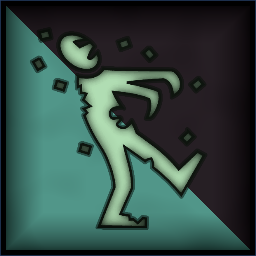
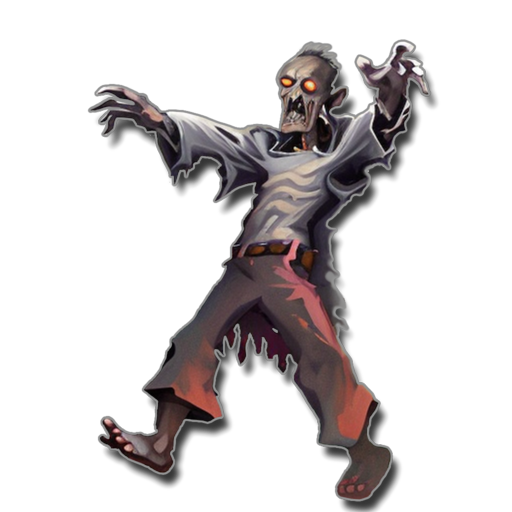
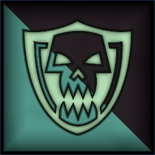

 <link rel="stylesheet" href="../../style.css">
 <link rel = "stylesheet" href = "factionSource.css">
# Dead Nations #
 
Commanders
Min: 1 Max: 1

 Infantry

Wight Lord

 
Hand Weapon and Shield+1 Defense. Charge Bonus: +1 Power
  or 
Greatweapon+1 Power. Charge Bonus: +1 Power.
 , 
Heavy Armor-1 Movement. +1 Defense
 , 
Reanimated-1 Movement. Never fails Discipline tests.
  

                

                 
3
4 
4
3
3
10
Skill
Power
Defense
Attacks
Wounds
Discipline

 <b> Cost:</b > 50 pts 
 <b> Retinue: </b> skeletons

 
Battle Line
Min: 1 Max: 5

 Infantry

Skeletons

 
Hand Weapon and Shield+1 Defense. Charge Bonus: +1 Power
 , 
Reanimated-1 Movement. Never fails Discipline tests.
  

                

                 
2
3 
2
1
1
10
Skill
Power
Defense
Attacks
Wounds
Discipline

 <b> Cost per Model:</b > 6 pts 
 <b> Unit Size: </b>: 10-20 

 Infantry

Zombies

 
UnarmedUnarmed attacks
 , 
Reanimated-1 Movement. Never fails Discipline tests.
  

                

                 
2
2 
3
1
1
10
Skill
Power
Defense
Attacks
Wounds
Discipline

 <b> Cost per Model:</b > 5 pts 
 <b> Unit Size: </b>: 10-24 

 Infantry

Wights

 
Hand Weapon and Shield+1 Defense. Charge Bonus: +1 Power
  or 
Greatweapon+1 Power. Charge Bonus: +1 Power.
 , 
Reanimated-1 Movement. Never fails Discipline tests.
 , 
Heavy Armor-1 Movement. +1 Defense
  

                

                 
4
4 
3
1
1
10
Skill
Power
Defense
Attacks
Wounds
Discipline

 <b> Cost per Model:</b > 12 pts 
 <b> Unit Size: </b>: 10-20 <b> Max Count: </b>: 1 

 
Fast Attack
Min: 0 Max: 1

 Cavalry

Wolves

 
FangsCharge Bonus: +1 Power
  

                

                 
3
4 
3
1
1
7
Skill
Power
Defense
Attacks
Wounds
Discipline

 <b> Cost per Model:</b > 12 pts 
 <b> Unit Size: </b>: 5-10 

 Cavalry

Skeleton Knights

 
Hand Weapon and Shield+1 Defense. Charge Bonus: +1 Power
  or 
Greatweapon+1 Power. Charge Bonus: +1 Power.
 , 
Reanimated-1 Movement. Never fails Discipline tests.
 , 
Heavy Armor-1 Movement. +1 Defense
  

                

                 
3
3 
3
2
2
8
Skill
Power
Defense
Attacks
Wounds
Discipline

 <b> Cost per Model:</b > 22 pts 
 <b> Unit Size: </b>: 5-10 

