 <link rel="stylesheet" href="../../style.css">
 <link rel = "stylesheet" href = "factionSource.css">
# Dead Nations #
 
Commanders
Min: 1 Max: 1

 Infantry

Wight Lord

 
Hand Weapon and Shield+1 Defense. Charge Bonus: +1 Power
 or 
Greatweapon+1 Power. Charge Bonus: +1 Power.
, 
Heavy Armor-1 Movement. +1 Defense
, 
Reanimated-1 Movement. Never fails Discipline tests.
, Magic Weapon/Item, 
TerrorTarget Unit has -3 Discipline this turn. Activate once per battle.
 

                

                 
4
4 
4
3
3
10
Skill
Power
Defense
Attacks
Wounds
Discipline

 <b> Cost:</b > 50 pts 

<b>Retinue Options: </b> Skeletons, Skeleton Spear, Zombies, Wights, Skeleton Knights, Bone Dragon

 Infantry

Vampire Knight

 
Hand Weapon and Shield+1 Defense. Charge Bonus: +1 Power
 or 
Greatweapon+1 Power. Charge Bonus: +1 Power.
, 
Heavy Armor-1 Movement. +1 Defense
, Magic Weapon/Item, Spellcaster(2) 

                

                 
5
4 
4
3
3
9
Skill
Power
Defense
Attacks
Wounds
Discipline

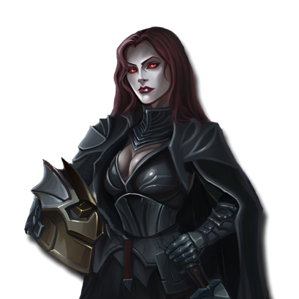

 <b> Cost:</b > 50 pts 

<b>Retinue Options: </b> Skeleton Knights, Dread Knights, Wights, Skeletons, Skeleton Spear, Zombies, Bone Dragon
<b>Spell Options: </b> Unholy Vigour, Shadow Bolt, Hex Of Ruin, Reanimate

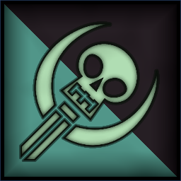
 Infantry

Necromancer

 
Hand WeaponCharge Bonus: +1 Power
, Magic Item, Spellcaster(2) 

                

                 
3
3 
4
2
3
8
Skill
Power
Defense
Attacks
Wounds
Discipline

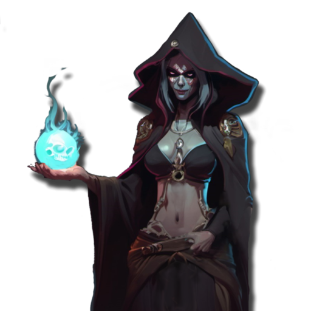

 <b> Cost:</b > 50 pts 

<b>Retinue Options: </b> Skeleton Spear, Skeletons, Zombies, Wights, Skeleton Knights
<b>Spell Options: </b> Raise Dead, Unholy Vigour, Reanimate, Shadow Bolt, Hex Of Ruin

 
Mounts

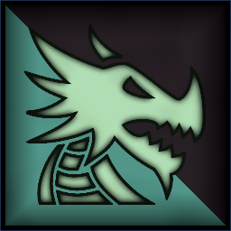
 Large Monster

Bone Dragon

 
FangsCharge Bonus: +1 Power
, 
Fire BreathRange 12. 2D3 Power 5.
, 
FlyingFly Speed 20. Ignore Terrain.
, 
Reanimated-1 Movement. Never fails Discipline tests.
 

                

                 
5
6 
5
5
7
10
Skill
Power
Defense
Attacks
Wounds
Discipline

 <b> Cost per Model:</b > 150 pts 
 <b> Unit Size: </b>: 1 

 
Battle Line
Min: 1 Max: 3

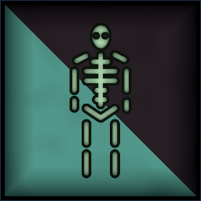
 Infantry

Skeleton Warriors

 
Hand Weapon and Shield+1 Defense. Charge Bonus: +1 Power
, 
Reanimated-1 Movement. Never fails Discipline tests.
, Magic Banner (up to 50pts) 

                

                 
2
3 
2
1
1
10
Skill
Power
Defense
Attacks
Wounds
Discipline

 <b> Cost per Model:</b > 5 pts 
 <b> Unit Size: </b>: 15-25 

 Infantry

Zombies

 
UnarmedUnarmed attacks
, 
Reanimated-1 Movement. Never fails Discipline tests.
 

                

                 
2
2 
3
1
1
10
Skill
Power
Defense
Attacks
Wounds
Discipline

 <b> Cost per Model:</b > 4 pts 
 <b> Unit Size: </b>: 15-25 

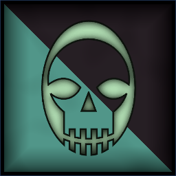
 Infantry

Wight Guard

 
Hand Weapon and Shield+1 Defense. Charge Bonus: +1 Power
 or 
Greatweapon+1 Power. Charge Bonus: +1 Power.
, 
Reanimated-1 Movement. Never fails Discipline tests.
, 
Heavy Armor-1 Movement. +1 Defense
, Magic Banner (up to 100pts) 

                

                 
4
4 
3
1
1
10
Skill
Power
Defense
Attacks
Wounds
Discipline

 <b> Cost per Model:</b > 12 pts 
 <b> Unit Size: </b>: 10-21 <b> Max Count: </b>: 1 

 Infantry

Skeleton Spear

 
Spear and Shield+1 Defense. Extra Rank supporting attacks when not charging.
, 
Reanimated-1 Movement. Never fails Discipline tests.
, Magic Banner (up to 50pts) 

                

                 
2
3 
2
1
1
10
Skill
Power
Defense
Attacks
Wounds
Discipline

 <b> Cost per Model:</b > 5 pts 
 <b> Unit Size: </b>: 15-25 

 
Ranged Support
Min: 0 Max: 1

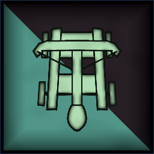
 War Machine

Unearthed Catapult

 
CatapultRange 48. 2D3 hits, Power 5.
, 
Reanimated-1 Movement. Never fails Discipline tests.
, 
Protected CrewUnit counts as being in Cover. (-1 to Ranged attack rolls against it).
 

                

                 
3
3 
5
2
5
10
Skill
Power
Defense
Attacks
Wounds
Discipline

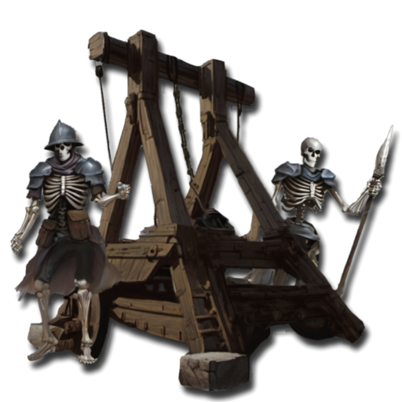

 <b> Cost per Model:</b > 60 pts 
 <b> Unit Size: </b>: 1 

 Infantry

Skeleton Bowmen

 
LongbowsRange: 30. Power 3.
, 
Reanimated-1 Movement. Never fails Discipline tests.
, Magic Banner (up to 50pts) 

                

                 
2
3 
2
1
1
10
Skill
Power
Defense
Attacks
Wounds
Discipline

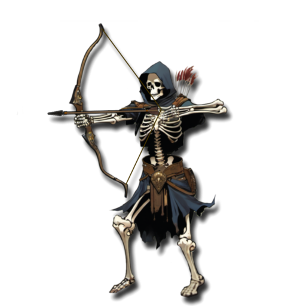

 <b> Cost per Model:</b > 6 pts 
 <b> Unit Size: </b>: 10-15 

 
Fast Attack
Min: 0 Max: 1

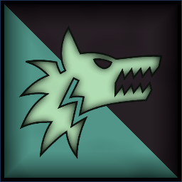
 Cavalry

Dire Wolves

 
FangsCharge Bonus: +1 Power
 

                

                 
3
4 
3
2
1
7
Skill
Power
Defense
Attacks
Wounds
Discipline

 <b> Cost per Model:</b > 10 pts 
 <b> Unit Size: </b>: 5-10 

 Cavalry

Skeleton Knights

 
Hand Weapon and Shield+1 Defense. Charge Bonus: +1 Power
 or 
Lance and Shield (2 pts)+1 Defense. Charge Bonus: +2 Power
, 
Reanimated-1 Movement. Never fails Discipline tests.
, 
Heavy Armor-1 Movement. +1 Defense
, Magic Banner (up to 100pts) 

                

                 
3
3 
3
2
2
10
Skill
Power
Defense
Attacks
Wounds
Discipline

 <b> Cost per Model:</b > 20 pts 
 <b> Unit Size: </b>: 5-10 

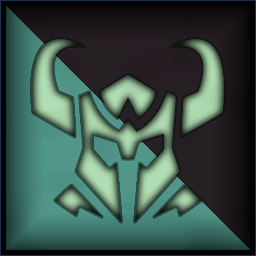
 Cavalry

Dread Knights

 
Greatweapon+1 Power. Charge Bonus: +1 Power.
 or 
Lance and Shield (2 pts)+1 Defense. Charge Bonus: +2 Power
, 
Reanimated-1 Movement. Never fails Discipline tests.
, 
Heavy Armor-1 Movement. +1 Defense
, Magic Banner (up to 100pts) 

                

                 
4
4 
4
2
2
10
Skill
Power
Defense
Attacks
Wounds
Discipline

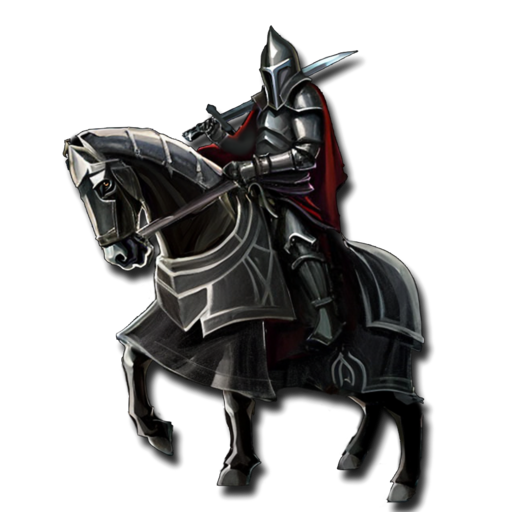

 <b> Cost per Model:</b > 30 pts 
 <b> Unit Size: </b>: 5 <b> Max Count: </b>: 1 

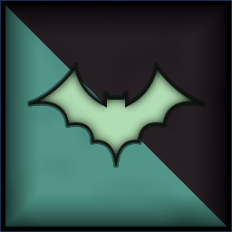
 Monstrous Infantry

Fell Bats

 
FangsCharge Bonus: +1 Power
, 
FlyingFly Speed 20. Ignore Terrain.
 

                

                 
3
3 
3
2
2
7
Skill
Power
Defense
Attacks
Wounds
Discipline

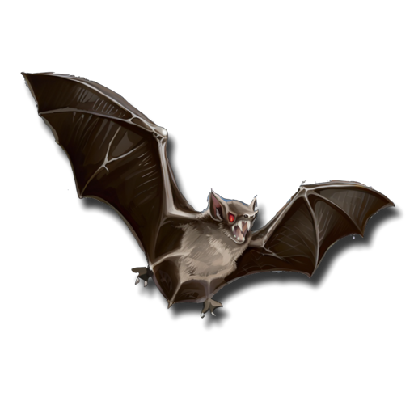

 <b> Cost per Model:</b > 18 pts 
 <b> Unit Size: </b>: 3 

 
Abominations
Min: 0 Max: 1

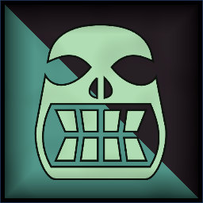
 Large Monster

Zombie Giant

 
Reanimated-1 Movement. Never fails Discipline tests.
, 
Putrid StenchOpponents re-roll hits in close combat.
 

                

                 
2
6 
6
4
8
10
Skill
Power
Defense
Attacks
Wounds
Discipline

 <b> Cost per Model:</b > 100 pts 
 <b> Unit Size: </b>: 1 <b> Max Count: </b>: 1 

