 <link rel="stylesheet" href="../../style.css">
 <link rel = "stylesheet" href = "factionSource.css">
# Deepwood Guardians #
 
Commanders
Min: 1 Max: 1

 Infantry

Deepwood Noble

 
Hand Weapon and Shield (5 pts)+1 Defense. Charge Bonus: +1 Power
 or 
Greatweapon (10 pts)+1 Power. Charge Bonus: +1 Power.
 or 
Two Hand Weapons (10 pts)+1 Attack
, 
Hunters Bow (10 pts)Range: 30. 3x Power 3.
, 
Swift+1 Movement
, Magic Weapon/Item, 
Elven AccuracyRe-roll missed Ranged Attack Rolls.
, 
Hunters Call+2 Move Speed to all infantry units for one turn. Activate once per battle. 
 

                

                 
5
4 
3
3
3
9
Skill
Power
Defense
Attacks
Wounds
Discipline

 <b> Cost:</b > 50 pts 

<b>Retinue Options: </b> Deepwood Guard, Deepwood Archers, Deepwood Chariot, Deepwood Riders, Gryphon, Forest Dragon

 Infantry

Deepwood Druid

 
Swift+1 Movement
, Magic Item, Spellcaster(2) 

                

                 
4
3 
3
2
3
8
Skill
Power
Defense
Attacks
Wounds
Discipline

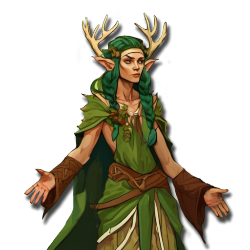

 <b> Cost:</b > 60 pts 

<b>Retinue Options: </b> Deepwood Archers, Deepwood Guard, Deepwood Chariot, Deepwood Riders, Gryphon, Forest Dragon
<b>Spell Options: </b> Regrowth, Wildform, Divine Favour, Arcane Web, Thousand Mouths, Radiant Shield, Shroud

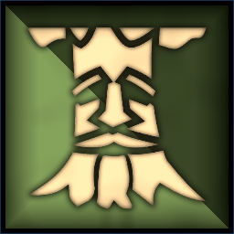
 Large Monster

Treant Elder

 
FearlessIgnores all penalties to Discipline tests.
, 
Forest SpiritA spirit of nature. Ignores Difficult Terrain.
, 
Barkskin-1 Movement. +1 Defense
, 
Take RootFor one turn, reduce move speed to zero. Re-roll failed damage saves and discipline tests. Activate once per battle.
, Magic Weapon/Item 

                

                 
4
6 
6
6
8
10
Skill
Power
Defense
Attacks
Wounds
Discipline

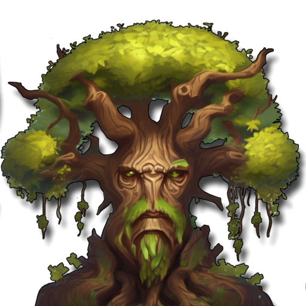

 <b> Cost:</b > 150 pts 

 
Mounts

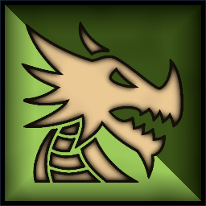
 Large Monster

Forest Dragon

 
FangsCharge Bonus: +1 Power
, 
Fire BreathRange 12. 2D3 Power 5.
, 
FlyingFly Speed 20. Ignore Terrain.
 

                

                 
5
6 
5
5
7
9
Skill
Power
Defense
Attacks
Wounds
Discipline

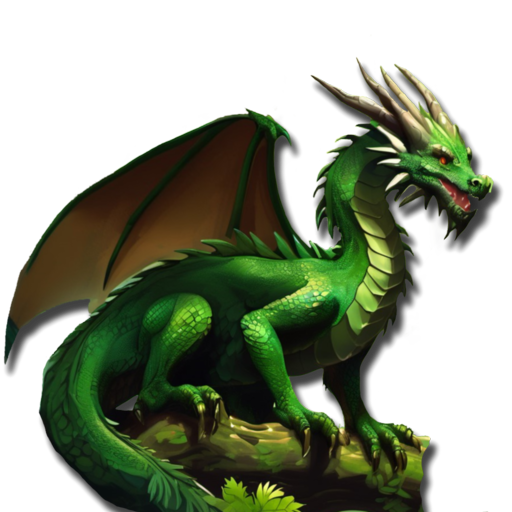

 <b> Cost per Model:</b > 150 pts 
 <b> Unit Size: </b>: 1 

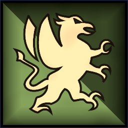
 Monstrous Infantry

Gryphon

 
ClawsCharge Bonus: +1 Power
, 
FlyingFly Speed 20. Ignore Terrain.
 

                

                 
4
5 
5
3
5
8
Skill
Power
Defense
Attacks
Wounds
Discipline

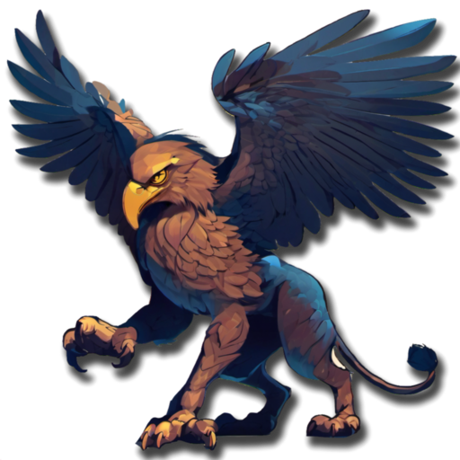

 <b> Cost per Model:</b > 55 pts 
 <b> Unit Size: </b>: 1 

 
Battle Line
Min: 1 Max: 3

 Infantry

Deepwood Guard

 
Spear and Shield+1 Defense. Extra Rank supporting attacks when not charging.
, 
Swift+1 Movement
, Magic Banner (up to 50pts) 

                

                 
4
3 
3
1
1
8
Skill
Power
Defense
Attacks
Wounds
Discipline

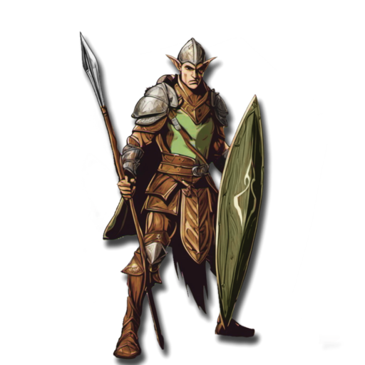

 <b> Cost per Model:</b > 8 pts 
 <b> Unit Size: </b>: 10-21 

 Infantry Large

Dryads

 
ClawsCharge Bonus: +1 Power
, 
Barkskin-1 Movement. +1 Defense
, 
Forest SpiritA spirit of nature. Ignores Difficult Terrain.
, Magic Banner (up to 100pts), 
FearlessIgnores all penalties to Discipline tests.
 

                

                 
3
4 
4
1
2
10
Skill
Power
Defense
Attacks
Wounds
Discipline

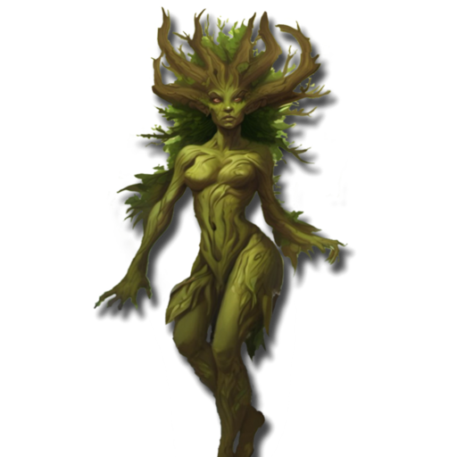

 <b> Cost per Model:</b > 14 pts 
 <b> Unit Size: </b>: 8-15 <b> Max Count: </b>: 1 

 Infantry

Deepwood Dancers

 
Two Hand Weapons+1 Attack
, 
Swift+1 Movement
, Magic Banner (up to 100pts), 
Elven MasteryRe-roll missed Attack Rolls.
, 
ScoutIgnore movement penalties from Difficult Terrain
 

                

                 
5
3 
3
1
1
8
Skill
Power
Defense
Attacks
Wounds
Discipline

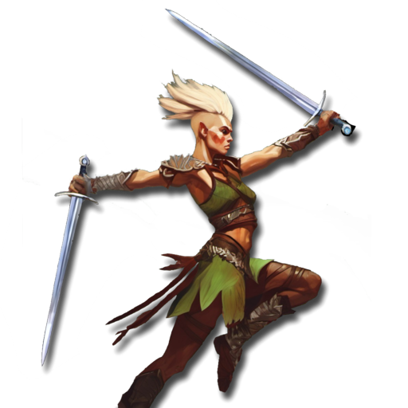

 <b> Cost per Model:</b > 11 pts 
 <b> Unit Size: </b>: 10-18 <b> Max Count: </b>: 1 

 
Ranged Support
Min: 0 Max: 1

 Infantry

Deepwood Archers

 
LongbowsRange: 30. Power 3.
, 
Swift+1 Movement
, 
ScoutIgnore movement penalties from Difficult Terrain
, Magic Banner (up to 50pts) 

                

                 
4
3 
3
1
1
8
Skill
Power
Defense
Attacks
Wounds
Discipline

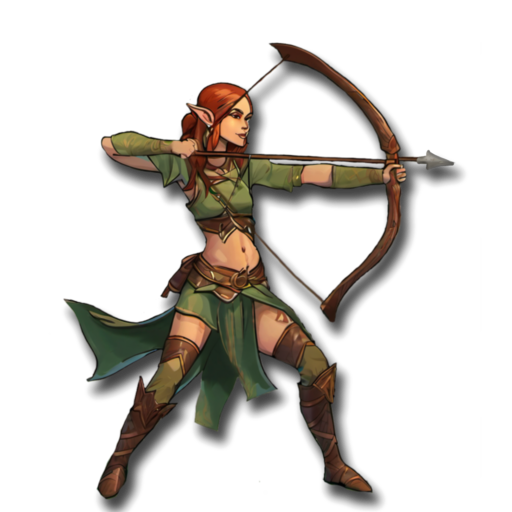

 <b> Cost per Model:</b > 10 pts 
 <b> Unit Size: </b>: 10-20 

 Infantry

Deepwood Rangers

 
Two Hand Weapons+1 Attack
, 
LongbowsRange: 30. Power 3.
, 
Swift+1 Movement
, 
ScoutIgnore movement penalties from Difficult Terrain
, Magic Banner (up to 100pts), 
AmbusherUnit can be deployed anywhere on it's owners side of the table.
, 
Elven AccuracyRe-roll missed Ranged Attack Rolls.
 

                

                 
4
3 
3
1
1
9
Skill
Power
Defense
Attacks
Wounds
Discipline

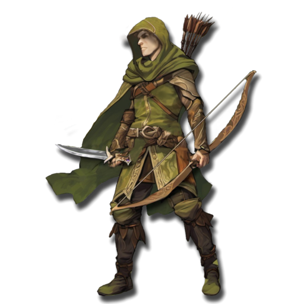

 <b> Cost per Model:</b > 15 pts 
 <b> Unit Size: </b>: 5-15 <b> Max Count: </b>: 1 

 
Fast Attack
Min: 0 Max: 1

 Cavalry

Deepwood Riders

 
Hand WeaponCharge Bonus: +1 Power
 or 
Hand Weapon and Shield (2 pts)+1 Defense. Charge Bonus: +1 Power
, 
ShortbowsRange: 20. Power 3.
, 
Swift+1 Movement
, Magic Banner (up to 50pts) 

                

                 
4
3 
3
2
2
8
Skill
Power
Defense
Attacks
Wounds
Discipline

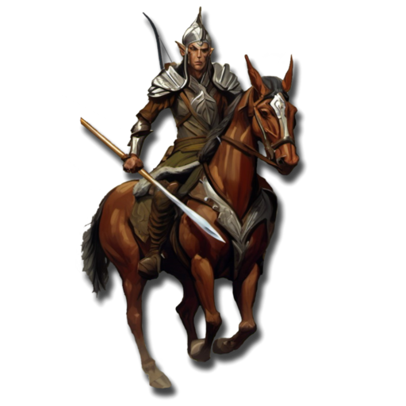

 <b> Cost per Model:</b > 18 pts 
 <b> Unit Size: </b>: 5-10 <b> Max Count: </b>: 1 

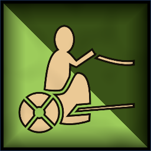
 Chariot

Deepwood Chariot

 
Hand WeaponCharge Bonus: +1 Power
, 
BowsRange: 20. 2x Power 3.
, 
Crushing ChargeCharge Bonus: +2 Power +2 Attacks
, 
Swift+1 Movement
 

                

                 
4
3 
5
3
5
8
Skill
Power
Defense
Attacks
Wounds
Discipline

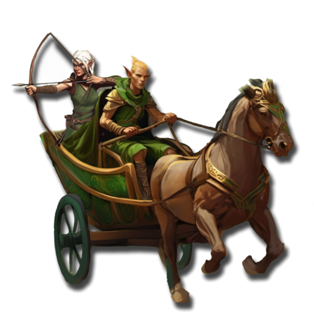

 <b> Cost per Model:</b > 55 pts 
 <b> Unit Size: </b>: 1 <b> Max Count: </b>: 1 

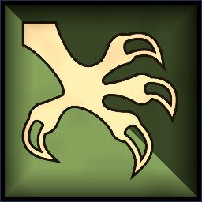
 Monstrous Infantry

Giant Eagle

 
ClawsCharge Bonus: +1 Power
, 
FlyingFly Speed 20. Ignore Terrain.
 

                

                 
4
4 
4
3
4
9
Skill
Power
Defense
Attacks
Wounds
Discipline

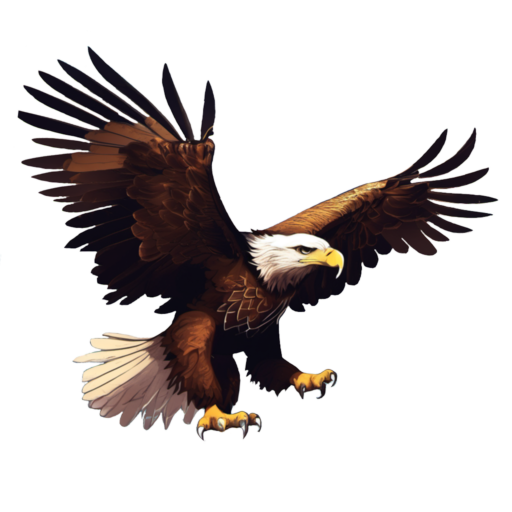

 <b> Cost per Model:</b > 55 pts 
 <b> Unit Size: </b>: 1 <b> Max Count: </b>: 2 

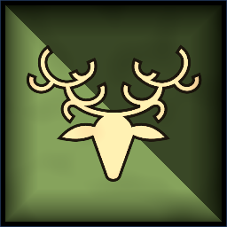
 Cavalry

Stag Riders

 
HornsCharge Bonus: +1 Power, +1 Attack
, 
Swift+1 Movement
, Magic Banner (up to 100pts) 

                

                 
4
4 
4
2
2
8
Skill
Power
Defense
Attacks
Wounds
Discipline

 <b> Cost per Model:</b > 22 pts 
 <b> Unit Size: </b>: 5-10 

 
Forest Guardians
Min: 0 Max: 1

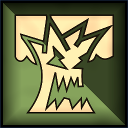
 Large Monster

Treant

 
FearlessIgnores all penalties to Discipline tests.
, 
Forest SpiritA spirit of nature. Ignores Difficult Terrain.
, 
Barkskin-1 Movement. +1 Defense
 

                

                 
4
6 
6
5
8
10
Skill
Power
Defense
Attacks
Wounds
Discipline

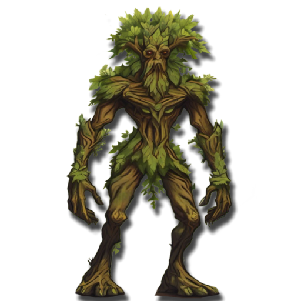

 <b> Cost per Model:</b > 100 pts 
 <b> Unit Size: </b>: 1 <b> Max Count: </b>: 1 

