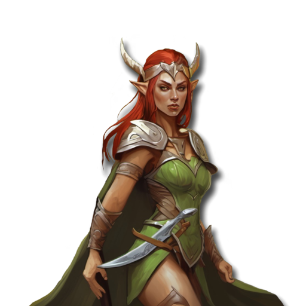
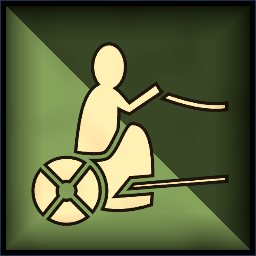

 <link rel="stylesheet" href="../../style.css">
 <link rel = "stylesheet" href = "factionSource.css">
# Deepwood Guardians #
 
Commanders
Min: 1 Max: 1

 Infantry

Deepwood Noble

 
Hand Weapon and Shield (5 pts)+1 Defense. Charge Bonus: +1 Power
  or 
Greatweapon (10 pts)+1 Power. Charge Bonus: +1 Power.
  or 
Two Hand Weapons (10 pts)+1 Attack
 , 
Hunters Bow (10 pts)Range: 30. 3x Power 3.
 , 
Swift+1 Movement
 , , 
Elven AccuracyRe-roll missed Ranged Attack Rolls.
 , 
Hunters Call+4 Move Speed to all infantry units this turn. Activate once per battle. 
  

                

                 
5
4 
3
3
3
9
Skill
Power
Defense
Attacks
Wounds
Discipline

 <b> Cost:</b > 50 pts 
 <b> Retinue: </b> SOVL.RetinueOption

 Infantry

Deepwood Druid

 
Swift+1 Movement
 , ,  

                

                 
4
3 
3
2
3
8
Skill
Power
Defense
Attacks
Wounds
Discipline

 <b> Cost:</b > 50 pts 
 <b> Retinue: </b> SOVL.RetinueOption

 
Battle Line
Min: 1 Max: 4

 Infantry

Deepwood Guard

 
Spear and Shield+1 Defense. Charge Defense: +1 Power
 , 
Swift+1 Movement
 ,  

                

                 
4
3 
3
1
1
8
Skill
Power
Defense
Attacks
Wounds
Discipline

 <b> Cost per Model:</b > 8 pts 
 <b> Unit Size: </b>: 10-20 

 Infantry Large

Dryads

 
ClawsCharge Bonus: +1 Power
 , 
Barkskin-1 Movement. +1 Defense
 , 
Forest SpiritA spirit of nature. Ignores Difficult Terrain.
 ,  

                

                 
3
4 
4
1
2
10
Skill
Power
Defense
Attacks
Wounds
Discipline

 <b> Cost per Model:</b > 16 pts 
 <b> Unit Size: </b>: 10-15 <b> Max Count: </b>: 1 

 Infantry

Deepwood Dancers

 
Two Hand Weapons+1 Attack
 , 
Swift+1 Movement
 , , 
Elven MasteryRe-roll missed Attack Rolls.
 , 
ScoutIgnore Difficult Terrain
  

                

                 
5
3 
3
1
1
8
Skill
Power
Defense
Attacks
Wounds
Discipline

 <b> Cost per Model:</b > 12 pts 
 <b> Unit Size: </b>: 10-15 <b> Max Count: </b>: 1 

 
Ranged Support
Min: 0 Max: 1

 Infantry

Deepwood Archers

 
LongbowsRange: 30. Power 3.
 , 
Swift+1 Movement
 , 
ScoutIgnore Difficult Terrain
 ,  

                

                 
4
3 
3
1
1
8
Skill
Power
Defense
Attacks
Wounds
Discipline

 <b> Cost per Model:</b > 10 pts 
 <b> Unit Size: </b>: 10-20 

 Infantry

Deepwood Rangers

 
Two Hand Weapons+1 Attack
 , 
LongbowsRange: 30. Power 3.
 , 
Swift+1 Movement
 , 
ScoutIgnore Difficult Terrain
 , , 
AmbusherUnit can be deployed anywhere on it's owners side of the table.
 , 
Elven AccuracyRe-roll missed Ranged Attack Rolls.
  

                

                 
4
3 
3
1
1
9
Skill
Power
Defense
Attacks
Wounds
Discipline

 <b> Cost per Model:</b > 13 pts 
 <b> Unit Size: </b>: 5-15 <b> Max Count: </b>: 1 

 
Fast Attack
Min: 0 Max: 1

 Cavalry

Deepwood Riders

 
Hand WeaponCharge Bonus: +1 Power
  or 
Hand Weapon and Shield (2 pts)+1 Defense. Charge Bonus: +1 Power
 , 
ShortbowsRange: 20. Power 3.
 , 
Swift+1 Movement
 ,  

                

                 
4
3 
3
2
2
8
Skill
Power
Defense
Attacks
Wounds
Discipline

 <b> Cost per Model:</b > 19 pts 
 <b> Unit Size: </b>: 5-10 <b> Max Count: </b>: 1 

 Chariot

Deepwood Chariot

 
Hand WeaponCharge Bonus: +1 Power
 , 
BowsRange: 20. 2x Power 3.
 , 
Crushing ChargeCharge Bonus: +2 Power +2 Attacks
 , 
Swift+1 Movement
  

                

                 
4
3 
5
3
4
8
Skill
Power
Defense
Attacks
Wounds
Discipline

 <b> Cost per Model:</b > 75 pts 
 <b> Unit Size: </b>: 1 <b> Max Count: </b>: 1 

 Monstrous Infantry

Giant Eagle

 
ClawsCharge Bonus: +1 Power
 , 
FlyingFly Speed 20. Ignore Terrain.
  

                

                 
4
4 
5
3
4
9
Skill
Power
Defense
Attacks
Wounds
Discipline

 <b> Cost per Model:</b > 45 pts 
 <b> Unit Size: </b>: 1 

 
Forest Guardians
Min: 0 Max: 1

 Large Monster

Treant

 
FearlessIgnores all penalties to Discipline tests.
 , 
Forest SpiritA spirit of nature. Ignores Difficult Terrain.
 , 
Barkskin-1 Movement. +1 Defense
  

                

                 
3
6 
6
5
8
10
Skill
Power
Defense
Attacks
Wounds
Discipline

 <b> Cost per Model:</b > 100 pts 
 <b> Unit Size: </b>: 1 <b> Max Count: </b>: 1 

