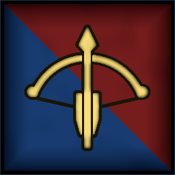
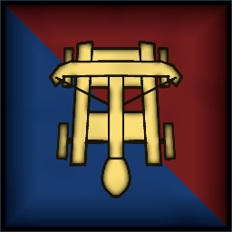
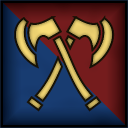
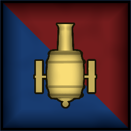

 <link rel="stylesheet" href="../../style.css">
 <link rel = "stylesheet" href = "factionSource.css">
# Dwarf Holds #
 
Commanders
Min: 1 Max: 1

 Infantry

Dwarf Foreman

 
Hand Weapon and Shield (5 pts)+1 Defense. Charge Bonus: +1 Power
 or 
Greatweapon (10 pts)+1 Power. Charge Bonus: +1 Power.
, 
Sturdy-1 Movement. Ignore the movement penalty from Heavy Armor.
, 
Shield WallActivate once per battle. Commander and Retinue rerolls Damage Saves for one turn.
, Magic Weapon/Item 

                

                 
4
4 
4
3
3
9
Skill
Power
Defense
Attacks
Wounds
Discipline

 <b> Cost:</b > 50 pts 

<b>Retinue Options: </b> Dwarf Warriors, Dwarf Miners, Dwarf Veterans

 Infantry

Ranger Captain

 
Two Hand Weapons (5 pts)+1 Attack
 or 
Greatweapon (10 pts)+1 Power. Charge Bonus: +1 Power.
, 
Marksman Rifle (10 pts)Range 48. 2x Power 4.
, 
Sturdy-1 Movement. Ignore the movement penalty from Heavy Armor.
, 
Hunters Call+2 Move Speed to all infantry units for one turn. Activate once per battle. 
, 
AmbusherUnit can be deployed anywhere on it's owners side of the table.
, Magic Weapon/Item 

                

                 
4
4 
4
3
3
8
Skill
Power
Defense
Attacks
Wounds
Discipline

 <b> Cost:</b > 50 pts 

<b>Retinue Options: </b> Dwarf Crossbows, Dwarf Rangers, Dwarf Handguns

 Infantry

Dwarf Engineer

 
Hand Weapon and Shield (5 pts)+1 Defense. Charge Bonus: +1 Power
 or 
Greatweapon (10 pts)+1 Power. Charge Bonus: +1 Power.
, 
Dwarf Pistol (10 pts)Range 18. 2x Power 4.
, 
Sturdy-1 Movement. Ignore the movement penalty from Heavy Armor.
, 
Mechanical ExpertiseTarget Warmachine gets +2 Defense and rerolls 1s on Ranged Attack rolls this battle.
, Magic Weapon/Item 

                

                 
4
3 
4
2
3
9
Skill
Power
Defense
Attacks
Wounds
Discipline

 <b> Cost:</b > 45 pts 

<b>Retinue Options: </b> Dwarf Crossbows, Dwarf Handguns, Flying Machine

 
Battle Line
Min: 1 Max: 3

 Infantry

Dwarf Warriors

 
Hand Weapon and Shield+1 Defense. Charge Bonus: +1 Power
 or 
Greatweapon+1 Power. Charge Bonus: +1 Power.
, 
Sturdy-1 Movement. Ignore the movement penalty from Heavy Armor.
 

                

                 
3
3 
4
1
1
8
Skill
Power
Defense
Attacks
Wounds
Discipline

 <b> Cost per Model:</b > 7 pts 
 <b> Unit Size: </b>: 10-25 

 Infantry

Dwarf Veterans

 
Hand Weapon and Shield+1 Defense. Charge Bonus: +1 Power
 or 
Greatweapon+1 Power. Charge Bonus: +1 Power.
, 
Sturdy-1 Movement. Ignore the movement penalty from Heavy Armor.
, 
FearlessIgnores all penalties to Discipline tests.
, Magic Banner (up to 100pts) 

                

                 
4
3 
4
1
1
8
Skill
Power
Defense
Attacks
Wounds
Discipline

 <b> Cost per Model:</b > 9 pts 
 <b> Unit Size: </b>: 10-18 <b> Max Count: </b>: 1 

 Infantry

Dwarf Miners

 
Greatweapon+1 Power. Charge Bonus: +1 Power.
, 
Explosive Charges (25 pts)Range 8. 1D6 power 4. One use per battle.
, 
Sturdy-1 Movement. Ignore the movement penalty from Heavy Armor.
, Magic Banner (up to 50pts), 
AmbusherUnit can be deployed anywhere on it's owners side of the table.
 

                

                 
3
3 
4
1
1
8
Skill
Power
Defense
Attacks
Wounds
Discipline

 <b> Cost per Model:</b > 7 pts 
 <b> Unit Size: </b>: 10-21 <b> Max Count: </b>: 1 

 
Ranged Support
Min: 0 Max: 1

 Infantry

Dwarf Crossbows

 
CrossbowsRange: 30. Power 3.
, 
Sturdy-1 Movement. Ignore the movement penalty from Heavy Armor.
, Magic Banner (up to 50pts) 

                

                 
3
3 
4
1
1
8
Skill
Power
Defense
Attacks
Wounds
Discipline

 <b> Cost per Model:</b > 9 pts 
 <b> Unit Size: </b>: 10-15 

 Infantry

Dwarf Handguns

 
HandgunsRange: 24. Power 4. 
, 
Sturdy-1 Movement. Ignore the movement penalty from Heavy Armor.
, Magic Banner (up to 50pts) 

                

                 
3
3 
4
1
1
8
Skill
Power
Defense
Attacks
Wounds
Discipline

 <b> Cost per Model:</b > 9 pts 
 <b> Unit Size: </b>: 10-15 

 Infantry

Dwarf Rangers

 
Greatweapon+1 Power. Charge Bonus: +1 Power.
 or 
Two Hand Weapons+1 Attack
, 
CrossbowsRange: 30. Power 3.
, 
Sturdy-1 Movement. Ignore the movement penalty from Heavy Armor.
, 
ScoutIgnore movement penalties from Difficult Terrain
, Magic Banner (up to 100pts) 

                

                 
4
3 
4
1
1
8
Skill
Power
Defense
Attacks
Wounds
Discipline

 <b> Cost per Model:</b > 12 pts 
 <b> Unit Size: </b>: 10-15 <b> Max Count: </b>: 1 

 War Machine

Dwarf Cannon

 
CannonRange 48. D3 hits, Power 8.
, 
Lethal ShotsThis units ranged attack deals 2x wounds against multiwound targets.
, 
Protected CrewUnit counts as being in Cover. (-1 to Ranged attack rolls against it).
, 
Reposition+6 Movement this turn.
 

                

                 
3
3 
5
2
5
8
Skill
Power
Defense
Attacks
Wounds
Discipline

 <b> Cost per Model:</b > 55 pts 
 <b> Unit Size: </b>: 1 <b> Max Count: </b>: 1 

 War Machine

Dwarf Bolt Thrower

 
Bolt ThrowerRange 48. 3x Power 6.
, 
Lethal ShotsThis units ranged attack deals 2x wounds against multiwound targets.
, 
Protected CrewUnit counts as being in Cover. (-1 to Ranged attack rolls against it).
, 
Reposition+6 Movement this turn.
 

                

                 
3
3 
4
2
5
8
Skill
Power
Defense
Attacks
Wounds
Discipline

 <b> Cost per Model:</b > 40 pts 
 <b> Unit Size: </b>: 1 <b> Max Count: </b>: 1 

 War Machine

Dwarf Stonethrower

 
CatapultRange 48. 2D3 hits, Power 5.
, 
Protected CrewUnit counts as being in Cover. (-1 to Ranged attack rolls against it).
, 
Reposition+6 Movement this turn.
 

                

                 
3
3 
5
2
5
8
Skill
Power
Defense
Attacks
Wounds
Discipline

 <b> Cost per Model:</b > 50 pts 
 <b> Unit Size: </b>: 1 <b> Max Count: </b>: 1 

 
Elites
Min: 0 Max: 1

 Infantry

Dwarf Berserkers

 
Two Hand Weapons+1 Attack
, 
FrenzyRe-roll missed Attack Rolls in the first round of combat.
, 
Sturdy-1 Movement. Ignore the movement penalty from Heavy Armor.
, Magic Banner (up to 100pts) 

                

                 
3
4 
4
1
1
8
Skill
Power
Defense
Attacks
Wounds
Discipline

 <b> Cost per Model:</b > 9 pts 
 <b> Unit Size: </b>: 10-15 

 Infantry

Deep Guard

 
Hand Weapon and Shield+1 Defense. Charge Bonus: +1 Power
 or 
Greatweapon+1 Power. Charge Bonus: +1 Power.
, 
Sturdy-1 Movement. Ignore the movement penalty from Heavy Armor.
, 
Masterwork Armor+1 to Damage Saves
, Magic Banner (up to 100pts) 

                

                 
4
4 
4
1
1
9
Skill
Power
Defense
Attacks
Wounds
Discipline

 <b> Cost per Model:</b > 12 pts 
 <b> Unit Size: </b>: 10-15 

 
Machines of War
Min: 0 Max: 1

 War Machine

Inferno Cannon

 
Inferno CannonRange 16. 3D3 Power 5.
, 
Protected CrewUnit counts as being in Cover. (-1 to Ranged attack rolls against it).
, 
Reposition+6 Movement this turn.
 

                

                 
3
3 
5
2
5
8
Skill
Power
Defense
Attacks
Wounds
Discipline

 <b> Cost per Model:</b > 70 pts 
 <b> Unit Size: </b>: 1 <b> Max Count: </b>: 1 

 War Machine

Dwarf Flying Machine

 
Ramming SpeedCharge Bonus: +1 Power
, 
Steam GunRange 12. 2D3 Power 3.
, 
FlyingFly Speed 20. Ignore Terrain.
 

                

                 
3
4 
4
4
5
8
Skill
Power
Defense
Attacks
Wounds
Discipline

 <b> Cost per Model:</b > 65 pts 
 <b> Unit Size: </b>: 1 <b> Max Count: </b>: 1 

