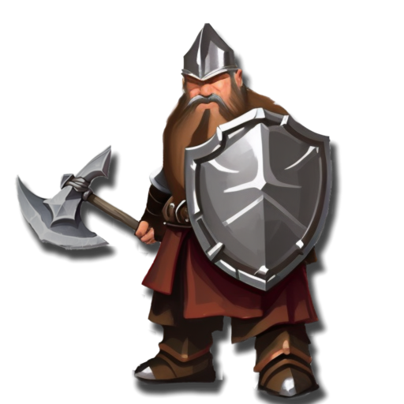
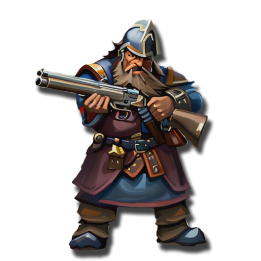

 <link rel="stylesheet" href="../../style.css">
 <link rel = "stylesheet" href = "factionSource.css">
# Dwarf Holds #
 
Commanders
Min: 1 Max: 1

 Infantry

Dwarf Foreman

 
Hand Weapon and Shield (5 pts)+1 Defense. Charge Bonus: +1 Power
  or 
Greatweapon (10 pts)+1 Power. Charge Bonus: +1 Power.
 , 
Sturdy-1 Movement. Ignore the movement penalty from Heavy Armor.
  

                

                 
4
4 
4
3
3
9
Skill
Power
Defense
Attacks
Wounds
Discipline

 <b> Cost:</b > 50 pts 
 <b> Retinue: </b> dwarfMiners

 Infantry

Ranger Captain

 
Two Hand Weapons (5 pts)+1 Attack
  or 
Greatweapon (10 pts)+1 Power. Charge Bonus: +1 Power.
 , 
CrossbowRange: 30. Power 3.
 , 
Sturdy-1 Movement. Ignore the movement penalty from Heavy Armor.
  

                

                 
4
4 
4
3
3
8
Skill
Power
Defense
Attacks
Wounds
Discipline

 <b> Cost:</b > 50 pts 
 <b> Retinue: </b> dwarfRangers

 
Battle Line
Min: 1 Max: 5

 Infantry

Dwarf Warriors

 
Hand Weapon and Shield+1 Defense. Charge Bonus: +1 Power
  or 
Greatweapon+1 Power. Charge Bonus: +1 Power.
 , 
Sturdy-1 Movement. Ignore the movement penalty from Heavy Armor.
  

                

                 
3
3 
4
1
1
8
Skill
Power
Defense
Attacks
Wounds
Discipline

 <b> Cost per Model:</b > 7 pts 
 <b> Unit Size: </b>: 10-25 

 Infantry

Dwarf Veterans

 
Hand Weapon and Shield+1 Defense. Charge Bonus: +1 Power
  or 
Greatweapon+1 Power. Charge Bonus: +1 Power.
 , 
Sturdy-1 Movement. Ignore the movement penalty from Heavy Armor.
 , 
FearlessIgnores all penalties to Discipline tests.
  

                

                 
4
3 
4
1
1
8
Skill
Power
Defense
Attacks
Wounds
Discipline

 <b> Cost per Model:</b > 9 pts 
 <b> Unit Size: </b>: 10-15 <b> Max Count: </b>: 1 

 Infantry

Dwarf Miners

 
Greatweapon+1 Power. Charge Bonus: +1 Power.
 , 
Sturdy-1 Movement. Ignore the movement penalty from Heavy Armor.
  

                

                 
3
3 
4
1
1
8
Skill
Power
Defense
Attacks
Wounds
Discipline

 <b> Cost per Model:</b > 9 pts 
 <b> Unit Size: </b>: 10-20 

 
Ranged Support
Min: 0 Max: 1

 Infantry

Dwarf Crossbows

 
CrossbowRange: 30. Power 3.
 , 
Sturdy-1 Movement. Ignore the movement penalty from Heavy Armor.
  

                

                 
3
3 
4
1
1
8
Skill
Power
Defense
Attacks
Wounds
Discipline

 <b> Cost per Model:</b > 10 pts 
 <b> Unit Size: </b>: 10-15 

 Infantry

Dwarf Handguns

 
HandgunRange: 24. Power 4. 
 , 
Sturdy-1 Movement. Ignore the movement penalty from Heavy Armor.
  

                

                 
3
3 
4
1
1
8
Skill
Power
Defense
Attacks
Wounds
Discipline

 <b> Cost per Model:</b > 11 pts 
 <b> Unit Size: </b>: 10-15 

 Infantry

Dwarf Rangers

 
Greatweapon+1 Power. Charge Bonus: +1 Power.
  or 
Two Hand Weapons+1 Attack
 , 
CrossbowRange: 30. Power 3.
 , 
Sturdy-1 Movement. Ignore the movement penalty from Heavy Armor.
 , 
ScoutIgnore Difficult Terrain
  

                

                 
4
3 
4
1
1
8
Skill
Power
Defense
Attacks
Wounds
Discipline

 <b> Cost per Model:</b > 14 pts 
 <b> Unit Size: </b>: 10-15 

 
Elites
Min: 0 Max: 1

 Infantry

Dwarf Berserkers

 
Two Hand Weapons+1 Attack
 , 
FrenzyRe-roll misses in combat.
 , 
Sturdy-1 Movement. Ignore the movement penalty from Heavy Armor.
  

                

                 
4
4 
4
1
1
8
Skill
Power
Defense
Attacks
Wounds
Discipline

 <b> Cost per Model:</b > 10 pts 
 <b> Unit Size: </b>: 10-15 

 Infantry

Deep Guard

 
Hand Weapon and Shield+1 Defense. Charge Bonus: +1 Power
  or 
Greatweapon (1 pts)+1 Power. Charge Bonus: +1 Power.
 , 
Sturdy-1 Movement. Ignore the movement penalty from Heavy Armor.
 , 
Heavy Armor-1 Movement. +1 Defense
  

                

                 
4
4 
4
1
1
9
Skill
Power
Defense
Attacks
Wounds
Discipline

 <b> Cost per Model:</b > 12 pts 
 <b> Unit Size: </b>: 10-15 

