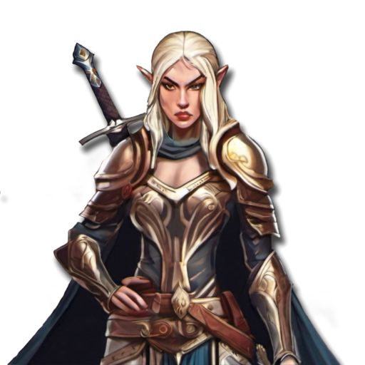
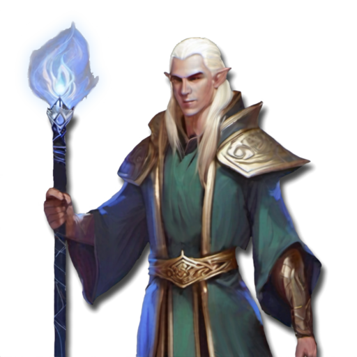
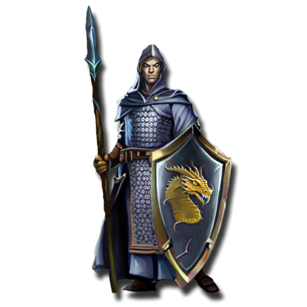
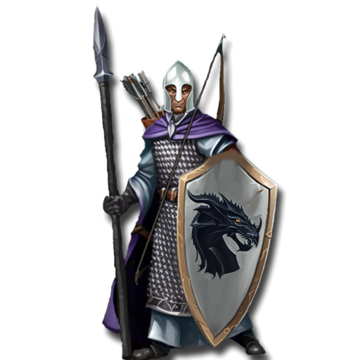
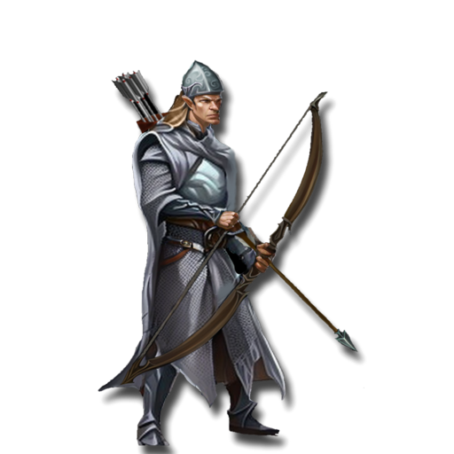
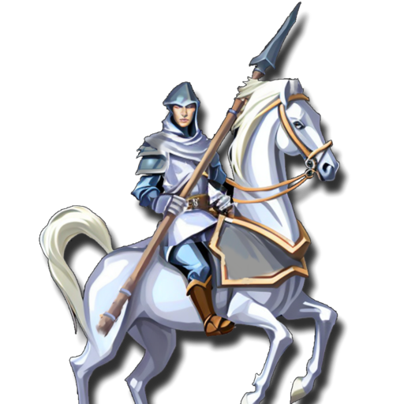
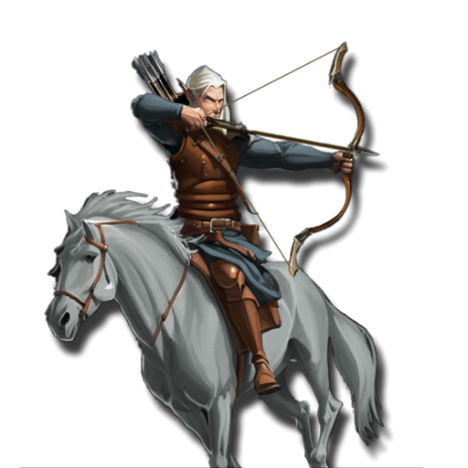
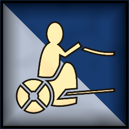

 <link rel="stylesheet" href="../../style.css">
 <link rel = "stylesheet" href = "factionSource.css">
# Elven Conclaves #
 
Commanders
Min: 1 Max: 1

 Infantry

Elf Noble

 
Hand Weapon and Shield (5 pts)+1 Defense. Charge Bonus: +1 Power
 or 
Greatweapon (10 pts)+1 Power. Charge Bonus: +1 Power.
 or 
Two Hand Weapons (10 pts)+1 Attack
, 
Swift+1 Movement
, Magic Weapon/Item, 
Elven MasteryRe-roll missed Attack Rolls.
 

                

                 
5
4 
3
3
3
9
Skill
Power
Defense
Attacks
Wounds
Discipline

 <b> Cost:</b > 50 pts 

<b>Retinue Options: </b> Elf Spears, Elf Lancers, Elf Reavers, Elf Chariot, Gryphon, Ancient Dragon

 Infantry

Elf Mage

 
Swift+1 Movement
, Magic Item, Spellcaster(2) 

                

                 
4
3 
3
2
3
8
Skill
Power
Defense
Attacks
Wounds
Discipline

 <b> Cost:</b > 50 pts 

<b>Retinue Options: </b> Elf Archers, Elf City Guard, Weapon Masters, Elf Chariot, Elf Reavers, Gryphon, Ancient Dragon
<b>Spell Options: </b> Divine Favour, Shadow Bolt, Fireball, Radiant Shield, Arcane Web, Frost Ward

 Infantry

Elf Spellsword

 
Hand Weapon and Shield (5 pts)+1 Defense. Charge Bonus: +1 Power
 or 
Greatweapon (10 pts)+1 Power. Charge Bonus: +1 Power.
 or 
Two Hand Weapons (10 pts)+1 Attack
, 
Swift+1 Movement
, Magic Weapon/Item, Spellcaster(1) 

                

                 
5
4 
3
3
3
8
Skill
Power
Defense
Attacks
Wounds
Discipline

 <b> Cost:</b > 50 pts 

<b>Retinue Options: </b> Weapon Masters, Elf Spears, Elf Lancers, Elf Reavers, Elf Chariot, Gryphon, Ancient Dragon
<b>Spell Options: </b> Divine Favour, Radiant Shield, Fireball

 
Mounts

 Large Monster

Ancient Dragon

 
FangsCharge Bonus: +1 Power
, 
Fire BreathRange 12. 2D3 Power 5.
, 
FlyingFly Speed 20. Ignore Terrain.
 

                

                 
5
6 
5
5
7
9
Skill
Power
Defense
Attacks
Wounds
Discipline

 <b> Cost per Model:</b > 150 pts 
 <b> Unit Size: </b>: 1 

 Monstrous Infantry

Gryphon

 
ClawsCharge Bonus: +1 Power
, 
FlyingFly Speed 20. Ignore Terrain.
 

                

                 
4
5 
5
3
5
8
Skill
Power
Defense
Attacks
Wounds
Discipline

 <b> Cost per Model:</b > 55 pts 
 <b> Unit Size: </b>: 1 

 
Battle Line
Min: 1 Max: 3

 Infantry

Elf Spears

 
Spear and Shield+1 Defense. Extra Rank supporting attacks when not charging.
, 
Swift+1 Movement
, Magic Banner (up to 50pts) 

                

                 
4
3 
3
1
1
8
Skill
Power
Defense
Attacks
Wounds
Discipline

 <b> Cost per Model:</b > 8 pts 
 <b> Unit Size: </b>: 10-21 

 Infantry

Elf City Guard

 
Spear and Shield+1 Defense. Extra Rank supporting attacks when not charging.
, 
LongbowsRange: 30. Power 3.
, 
Swift+1 Movement
, Magic Banner (up to 50pts) 

                

                 
4
3 
3
1
1
8
Skill
Power
Defense
Attacks
Wounds
Discipline

 <b> Cost per Model:</b > 11 pts 
 <b> Unit Size: </b>: 10-21 <b> Max Count: </b>: 1 

 Infantry

Weapon Masters

 
Greatweapon+1 Power. Charge Bonus: +1 Power.
 or 
HalberdDamage Saves against this weapon are never better than 4+.
, 
Swift+1 Movement
, 
Heavy Armor-1 Movement. +1 Defense
, Magic Banner (up to 100pts), 
Elven MasteryRe-roll missed Attack Rolls.
 

                

                 
5
3 
3
1
1
8
Skill
Power
Defense
Attacks
Wounds
Discipline

 <b> Cost per Model:</b > 12 pts 
 <b> Unit Size: </b>: 10-18 <b> Max Count: </b>: 1 

 
Ranged Support
Min: 0 Max: 1

 Infantry

Elf Archers

 
LongbowsRange: 30. Power 3.
, 
Swift+1 Movement
, Magic Banner (up to 50pts) 

                

                 
4
3 
3
1
1
8
Skill
Power
Defense
Attacks
Wounds
Discipline

 <b> Cost per Model:</b > 10 pts 
 <b> Unit Size: </b>: 10-20 

 Infantry

Elf Watchers

 
Two Hand Weapons+1 Attack
, 
LongbowsRange: 30. Power 3.
, 
Swift+1 Movement
, 
ScoutIgnore Difficult Terrain
, Magic Banner (up to 100pts), 
AmbusherUnit can be deployed anywhere on it's owners side of the table.
 

                

                 
4
3 
3
1
1
9
Skill
Power
Defense
Attacks
Wounds
Discipline

 <b> Cost per Model:</b > 13 pts 
 <b> Unit Size: </b>: 5-15 <b> Max Count: </b>: 1 

 War Machine

Elf Bolt Thrower

 
Bolt ThrowerRange 48. 3x Power 6.
, 
Swift+1 Movement
, 
Lethal ShotsThis units ranged attack deals 2x wounds against multiwound targets.
, 
Protected CrewUnit counts as being in Cover. (-1 to Ranged attack rolls against it).
 

                

                 
4
3 
4
2
5
8
Skill
Power
Defense
Attacks
Wounds
Discipline

 <b> Cost per Model:</b > 65 pts 
 <b> Unit Size: </b>: 1 <b> Max Count: </b>: 2 

 
Fast Attack
Min: 0 Max: 2

 Cavalry

Elf Lancers

 
Lance and Shield+1 Defense. Charge Bonus: +2 Power
, 
Swift+1 Movement
, 
Heavy Armor-1 Movement. +1 Defense
, Magic Banner (up to 100pts) 

                

                 
4
3 
3
2
2
8
Skill
Power
Defense
Attacks
Wounds
Discipline

 <b> Cost per Model:</b > 21 pts 
 <b> Unit Size: </b>: 5-10 

 Cavalry

Elf Reavers

 
Hand WeaponCharge Bonus: +1 Power
, 
ShortbowsRange: 20. Power 3.
, 
Swift+1 Movement
, Magic Banner (up to 50pts) 

                

                 
4
3 
3
2
2
8
Skill
Power
Defense
Attacks
Wounds
Discipline

 <b> Cost per Model:</b > 19 pts 
 <b> Unit Size: </b>: 5-10 <b> Max Count: </b>: 1 

 Chariot

Elf Chariot

 
Hand WeaponCharge Bonus: +1 Power
, 
Bows (5 pts)Range: 20. 2x Power 3.
, 
Crushing ChargeCharge Bonus: +2 Power +2 Attacks
, 
Swift+1 Movement
 

                

                 
4
3 
5
3
5
8
Skill
Power
Defense
Attacks
Wounds
Discipline

 <b> Cost per Model:</b > 55 pts 
 <b> Unit Size: </b>: 1 <b> Max Count: </b>: 1 

 Monstrous Infantry

Giant Eagle

 
ClawsCharge Bonus: +1 Power
, 
FlyingFly Speed 20. Ignore Terrain.
 

                

                 
4
4 
4
3
4
9
Skill
Power
Defense
Attacks
Wounds
Discipline

 <b> Cost per Model:</b > 50 pts 
 <b> Unit Size: </b>: 1 <b> Max Count: </b>: 2 

