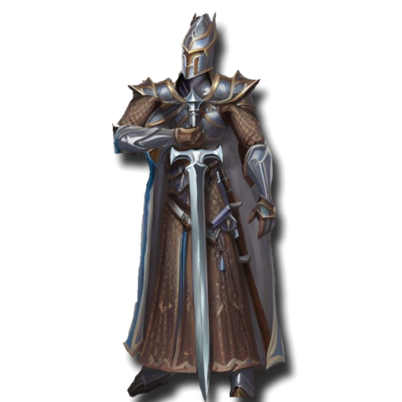
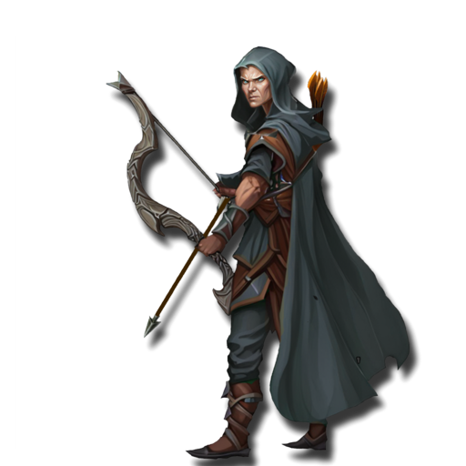

 <link rel="stylesheet" href="../../style.css">
 <link rel = "stylesheet" href = "factionSource.css">
# Elven Conclaves #
 
Commanders
Min: 1 Max: 1

   

      

Elf Noble

  

 Hand Weapon and Shield(5) or Greatweapon(10) or Dual Hand Weapons(10), Swift 

                

                 
5
4 
3
3
3
9
Skill
Power
Defense
Attacks
Wounds
Discipline

 <b> Cost:</b > 50 pts 
 <b> Retinue: </b> elfSpears

 
Battle Line
Min: 1 Max: 5

   

      

Elf Spears

  

 Spear and Shield, Swift 

                

                 
4
3 
3
1
1
8
Skill
Power
Defense
Attacks
Wounds
Discipline

 <b> Cost per Model:</b > 8 pts 
 <b> Unit Size: </b>: 10 - 20 

   

      

Elf City Guard

  

 Spear and Shield, Longbow, Swift 

                

                 
4
3 
3
1
1
8
Skill
Power
Defense
Attacks
Wounds
Discipline

 <b> Cost per Model:</b > 12 pts 
 <b> Unit Size: </b>: 10 - 20 <b> Max Count: </b>: 1 

   

      

Weapon Masters

  

 Greatweapon(0) or Halberd(0), Swift, Heavy Armor 

                

                 
5
3 
3
2
1
8
Skill
Power
Defense
Attacks
Wounds
Discipline

 <b> Cost per Model:</b > 12 pts 
 <b> Unit Size: </b>: 10 - 15 <b> Max Count: </b>: 1 

 
Ranged Support
Min: 0 Max: 1

   

      

Elf Archers

  

 Longbow, Swift 

                

                 
4
3 
3
1
1
8
Skill
Power
Defense
Attacks
Wounds
Discipline

 <b> Cost per Model:</b > 10 pts 
 <b> Unit Size: </b>: 10 - 20 

   

      

Elf Watchers

  

 Dual Hand Weapons, Longbow, Swift, Scout 

                

                 
5
3 
3
1
1
8
Skill
Power
Defense
Attacks
Wounds
Discipline

 <b> Cost per Model:</b > 14 pts 
 <b> Unit Size: </b>: 5 - 15 

 
Fast Attack
Min: 0 Max: 1

   

      

Elf Lancers

  

 Lance and Shield, Swift, Heavy Armor 

                

                 
4
3 
4
2
2
8
Skill
Power
Defense
Attacks
Wounds
Discipline

 <b> Cost per Model:</b > 21 pts 
 <b> Unit Size: </b>: 5 - 10 

   

      

Elf Reavers

  

 Hand Weapon, Shortbow, Swift 

                

                 
4
3 
3
2
2
8
Skill
Power
Defense
Attacks
Wounds
Discipline

 <b> Cost per Model:</b > 19 pts 
 <b> Unit Size: </b>: 5 - 5 <b> Max Count: </b>: 1 

