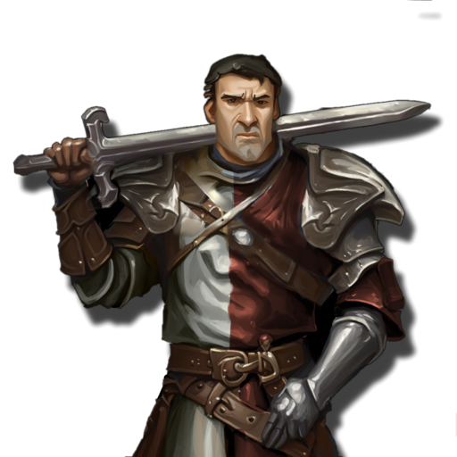
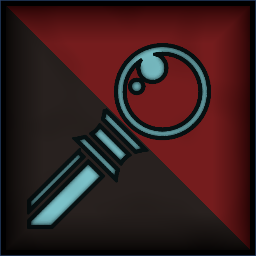
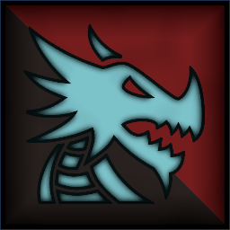
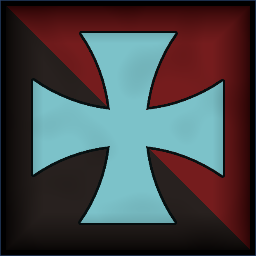
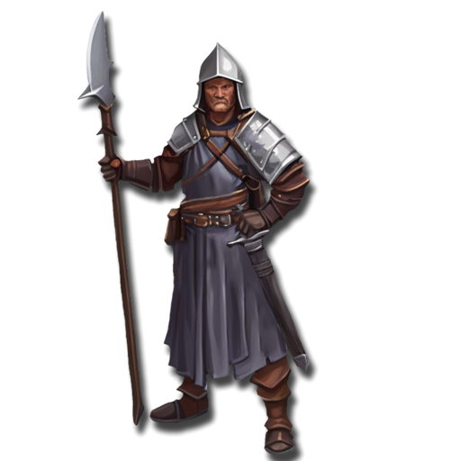
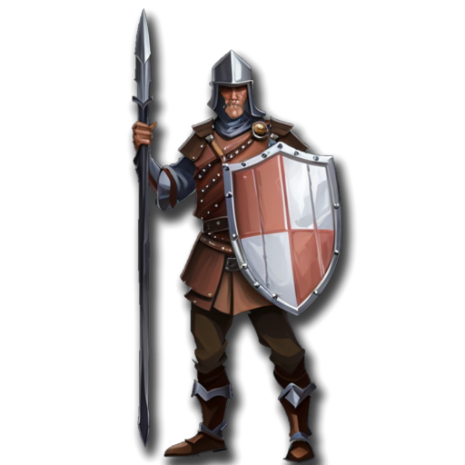
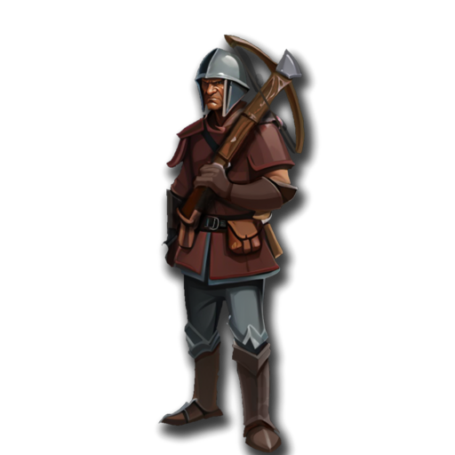
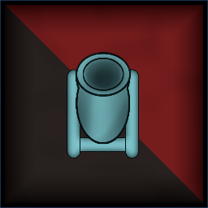

 <link rel="stylesheet" href="../../style.css">
 <link rel = "stylesheet" href = "factionSource.css">
# Empires of Men #
 
Commanders
Min: 1 Max: 1

 Infantry

Captain

 
Hand Weapon and Shield (5 pts)+1 Defense. Charge Bonus: +1 Power
 or 
Greatweapon (10 pts)+1 Power. Charge Bonus: +1 Power.
 or 
Two Hand Weapons (10 pts)+1 Attack
, 
Brace of Pistols (10 pts)Range 18. 2x Power 4.
, 
Inspire ValorActivate once per battle. Give all your units +1 Combat Score until end of turn.
, Magic Weapon/Item 

                

                 
4
4 
3
3
3
8
Skill
Power
Defense
Attacks
Wounds
Discipline

 <b> Cost:</b > 50 pts 

<b>Retinue Options: </b> Imperial Sword, Imperial Halberd, Imperial Spear, Light Cavalry, Gryphon

 Infantry Large

Knight Commander

 
Lance and Shield (10 pts)+1 Defense. Charge Bonus: +2 Power
 or 
Hand Weapon and Shield (5 pts)+1 Defense. Charge Bonus: +1 Power
 or 
Greatweapon (10 pts)+1 Power. Charge Bonus: +1 Power.
, 
Heavy Armor-1 Movement. +1 Defense
, 
Furious ChargeActivate once per battle. Commander and Retinue rerolls Attack Rolls this turn.
, Magic Weapon/Item 

                

                 
4
4 
3
3
3
8
Skill
Power
Defense
Attacks
Wounds
Discipline

 <b> Cost:</b > 60 pts 

<b>Retinue Options: </b> Imperial Knights, Foot Knights, Gryphon, Imperial Dragon

 Infantry

Imperial Wizard

 Spellcaster(2), Magic Item 

                

                 
4
3 
3
2
3
8
Skill
Power
Defense
Attacks
Wounds
Discipline

 <b> Cost:</b > 45 pts 

<b>Retinue Options: </b> Imperial Archers, Imperial Crossbowmen, Imperial Handguns, Foot Knights, Gryphon, Imperial Dragon
<b>Spell Options: </b> Fireball, Shadow Bolt, Hex Of Ruin, Radiant Shield, Divine Favour, Frost Ward

 
Mounts

 Monstrous Infantry

Gryphon

 
ClawsCharge Bonus: +1 Power
, 
FlyingFly Speed 20. Ignore Terrain.
 

                

                 
4
5 
5
3
5
8
Skill
Power
Defense
Attacks
Wounds
Discipline

 <b> Cost per Model:</b > 55 pts 
 <b> Unit Size: </b>: 1 

 Large Monster

Imperial Dragon

 
FangsCharge Bonus: +1 Power
, 
Fire BreathRange 12. 2D3 Power 5.
, 
FlyingFly Speed 20. Ignore Terrain.
 

                

                 
5
6 
5
5
7
9
Skill
Power
Defense
Attacks
Wounds
Discipline

 <b> Cost per Model:</b > 150 pts 
 <b> Unit Size: </b>: 1 

 
Battle Line
Min: 1 Max: 3

 Infantry

Imperial Sword

 
Hand Weapon and Shield+1 Defense. Charge Bonus: +1 Power
, Magic Banner (up to 50pts) 

                

                 
3
3 
3
1
1
7
Skill
Power
Defense
Attacks
Wounds
Discipline

 <b> Cost per Model:</b > 6 pts 
 <b> Unit Size: </b>: 10-21 

 Infantry

Foot Knights

 
Hand Weapon and Shield+1 Defense. Charge Bonus: +1 Power
 or 
Greatweapon (1 pts)+1 Power. Charge Bonus: +1 Power.
, 
Heavy Armor-1 Movement. +1 Defense
, Magic Banner (up to 100pts) 

                

                 
4
3 
3
1
1
8
Skill
Power
Defense
Attacks
Wounds
Discipline

 <b> Cost per Model:</b > 8 pts 
 <b> Unit Size: </b>: 10-18 <b> Max Count: </b>: 1 

 Infantry

Imperial Halberd

 
HalberdDamage Saves against this weapon are never better than 4+.
, Magic Banner (up to 50pts) 

                

                 
3
3 
3
1
1
7
Skill
Power
Defense
Attacks
Wounds
Discipline

 <b> Cost per Model:</b > 6 pts 
 <b> Unit Size: </b>: 10-21 

 Infantry

Imperial Spear

 
Spear and Shield+1 Defense. Extra Rank supporting attacks when not charging.
, Magic Banner (up to 50pts) 

                

                 
3
3 
3
1
1
7
Skill
Power
Defense
Attacks
Wounds
Discipline

 <b> Cost per Model:</b > 6 pts 
 <b> Unit Size: </b>: 10-21 

 
Fast Attack
Min: 0 Max: 1

 Cavalry

Imperial Knights

 
Hand Weapon and Shield+1 Defense. Charge Bonus: +1 Power
 or 
Greatweapon (1 pts)+1 Power. Charge Bonus: +1 Power.
 or 
Lance and Shield (2 pts)+1 Defense. Charge Bonus: +2 Power
, 
Heavy Armor-1 Movement. +1 Defense
, Magic Banner (up to 100pts) 

                

                 
4
3 
3
2
2
8
Skill
Power
Defense
Attacks
Wounds
Discipline

 <b> Cost per Model:</b > 19 pts 
 <b> Unit Size: </b>: 5-10 <b> Max Count: </b>: 1 

 Cavalry

Imperial Light Cavalry

 
Hand WeaponCharge Bonus: +1 Power
, 
Brace of PistolsRange 18. 2x Power 4.
, Magic Banner (up to 50pts) 

                

                 
3
3 
3
2
2
7
Skill
Power
Defense
Attacks
Wounds
Discipline

 <b> Cost per Model:</b > 19 pts 
 <b> Unit Size: </b>: 5-10 <b> Max Count: </b>: 1 

 
Ranged Support
Min: 0 Max: 1

 Infantry

Imperial Archers

 
LongbowsRange: 30. Power 3.
, Magic Banner (up to 50pts) 

                

                 
3
3 
3
1
1
7
Skill
Power
Defense
Attacks
Wounds
Discipline

 <b> Cost per Model:</b > 8 pts 
 <b> Unit Size: </b>: 10-20 

 Infantry

Imperial Crossbowmen

 
CrossbowsRange: 30. Power 3.
, Magic Banner (up to 50pts) 

                

                 
3
3 
3
1
1
7
Skill
Power
Defense
Attacks
Wounds
Discipline

 <b> Cost per Model:</b > 8 pts 
 <b> Unit Size: </b>: 10-20 

 Infantry

Imperial Handguns

 
HandgunsRange: 24. Power 4. 
, Magic Banner (up to 50pts) 

                

                 
3
3 
3
1
1
7
Skill
Power
Defense
Attacks
Wounds
Discipline

 <b> Cost per Model:</b > 8 pts 
 <b> Unit Size: </b>: 10-20 

 War Machine

Imperial Cannon

 
CannonRange 48. D3 hits, Power 8.
, 
Lethal ShotsThis units ranged attack deals 2x wounds against multiwound targets.
, 
Protected CrewUnit counts as being in Cover. (-1 to Ranged attack rolls against it).
 

                

                 
3
3 
5
2
5
7
Skill
Power
Defense
Attacks
Wounds
Discipline

 <b> Cost per Model:</b > 50 pts 
 <b> Unit Size: </b>: 1 <b> Max Count: </b>: 1 

 War Machine

Imperial Mortar

 
MortarRange 48. 2D3+1 hits, Power 4.
, 
Protected CrewUnit counts as being in Cover. (-1 to Ranged attack rolls against it).
 

                

                 
3
3 
5
2
5
7
Skill
Power
Defense
Attacks
Wounds
Discipline

 <b> Cost per Model:</b > 50 pts 
 <b> Unit Size: </b>: 1 <b> Max Count: </b>: 1 

