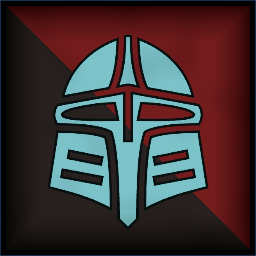
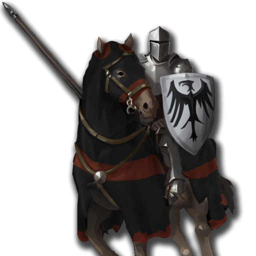
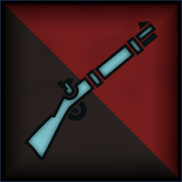
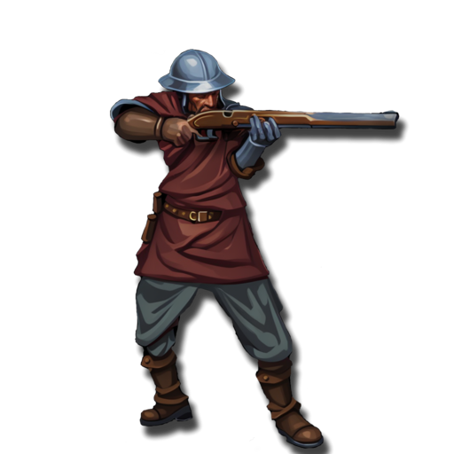

 <link rel="stylesheet" href="../../style.css">
 <link rel = "stylesheet" href = "factionSource.css">
# Empires of Men #
 
Commanders
Min: 1 Max: 1

 Infantry

Captain

 
Hand Weapon and Shield (5 pts)+1 Defense. Charge Bonus: +1 Power
  or 
Greatweapon (10 pts)+1 Power. Charge Bonus: +1 Power.
  or 
Two Hand Weapons (10 pts)+1 Attack
  

                

                 
4
4 
3
3
3
8
Skill
Power
Defense
Attacks
Wounds
Discipline

 <b> Cost:</b > 50 pts 
 <b> Retinue: </b> imperialSword

 Infantry Large

Knight Commander

 
Lance and Shield (10 pts)+1 Defense. Charge Bonus: +2 Power
  or 
Hand Weapon and Shield (5 pts)+1 Defense. Charge Bonus: +1 Power
  or 
Greatweapon (10 pts)+1 Power. Charge Bonus: +1 Power.
 , 
Heavy Armor-1 Movement. +1 Defense
  

                

                 
4
4 
3
3
3
8
Skill
Power
Defense
Attacks
Wounds
Discipline

 <b> Cost:</b > 60 pts 
 <b> Retinue: </b> imperialKnights

 
Battle Line
Min: 1 Max: 5

 Infantry

Imperial Sword

 
Hand Weapon and Shield+1 Defense. Charge Bonus: +1 Power
  

                

                 
3
3 
3
1
1
7
Skill
Power
Defense
Attacks
Wounds
Discipline

 <b> Cost per Model:</b > 6 pts 
 <b> Unit Size: </b>: 10-20 

 Infantry

Foot Knights

 
Hand Weapon and Shield+1 Defense. Charge Bonus: +1 Power
  or 
Greatweapon (1 pts)+1 Power. Charge Bonus: +1 Power.
 , 
Heavy Armor-1 Movement. +1 Defense
  

                

                 
4
3 
3
1
1
8
Skill
Power
Defense
Attacks
Wounds
Discipline

 <b> Cost per Model:</b > 8 pts 
 <b> Unit Size: </b>: 10-15 <b> Max Count: </b>: 1 

 Infantry

Imperial Halberd

 
Halberd+1 Power. Charge Defense: +1 Power
  

                

                 
3
3 
3
1
1
7
Skill
Power
Defense
Attacks
Wounds
Discipline

 <b> Cost per Model:</b > 6 pts 
 <b> Unit Size: </b>: 10-20 

 Infantry

Imperial Spear

 
Spear and Shield+1 Defense. Charge Defense: +1 Power
  

                

                 
3
3 
3
1
1
7
Skill
Power
Defense
Attacks
Wounds
Discipline

 <b> Cost per Model:</b > 6 pts 
 <b> Unit Size: </b>: 10-20 

 
Fast Attack
Min: 0 Max: 1

 Cavalry

Imperial Knights

 
Hand Weapon and Shield+1 Defense. Charge Bonus: +1 Power
  or 
Greatweapon (1 pts)+1 Power. Charge Bonus: +1 Power.
  or 
Lance and Shield (2 pts)+1 Defense. Charge Bonus: +2 Power
 , 
Heavy Armor-1 Movement. +1 Defense
  

                

                 
3
3 
3
2
2
7
Skill
Power
Defense
Attacks
Wounds
Discipline

 <b> Cost per Model:</b > 18 pts 
 <b> Unit Size: </b>: 5-10 <b> Max Count: </b>: 1 

 
Ranged Support
Min: 0 Max: 1

 Infantry

Imperial Archers

 
LongbowRange: 30. Power 3.
  

                

                 
3
3 
3
1
1
7
Skill
Power
Defense
Attacks
Wounds
Discipline

 <b> Cost per Model:</b > 9 pts 
 <b> Unit Size: </b>: 10-20 

 Infantry

Imperial Crossbowmen

 
CrossbowRange: 30. Power 3.
  

                

                 
3
3 
3
1
1
7
Skill
Power
Defense
Attacks
Wounds
Discipline

 <b> Cost per Model:</b > 9 pts 
 <b> Unit Size: </b>: 10-20 

 Infantry

Imperial Handguns

 
HandgunRange: 24. Power 4. 
  

                

                 
3
3 
3
1
1
7
Skill
Power
Defense
Attacks
Wounds
Discipline

 <b> Cost per Model:</b > 9 pts 
 <b> Unit Size: </b>: 10-20 

