 <link rel="stylesheet" href="../../style.css">
 <link rel = "stylesheet" href = "factionSource.css">
# Goatmen Raiders #
 
Commanders
Min: 1 Max: 1

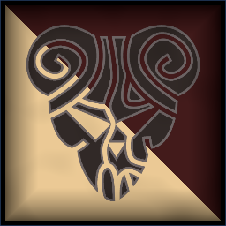
 Infantry

Goatman Shaman

 
Hand WeaponCharge Bonus: +1 Power
, Magic Item, Spellcaster(2) 

                

                 
3
4 
4
2
3
7
Skill
Power
Defense
Attacks
Wounds
Discipline

 <b> Cost:</b > 60 pts 

<b>Retinue Options: </b> Mongrel Pack, Goatmen Warriors, Ibex Warriors, Raiding Chariot, Mongrel Skirmishers
<b>Spell Options: </b> Wildform, Shadow Bolt, Thousand Mouths, Hex Of Ruin, Primal Fury, Shroud

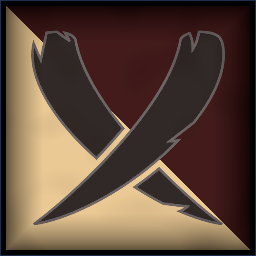
 Infantry

Goatman Longhorn

 
Greatweapon (5 pts)+1 Power. Charge Bonus: +1 Power.
 or 
Two Hand Weapons (10 pts)+1 Attack
, Magic Weapon/Item, 
RaiderCommanders retinue deploys with Ambush.
, 
WarcryAll your units have +1 Power for one turn.
 

                

                 
4
4 
4
3
3
8
Skill
Power
Defense
Attacks
Wounds
Discipline

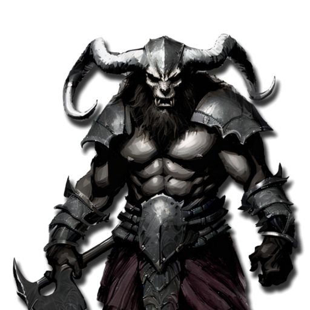

 <b> Cost:</b > 50 pts 

<b>Retinue Options: </b> Goatmen Warriors, Ibex Warriors, Raiding Chariot

 Monstrous Infantry

Minotaur Lord

 
Two Hand Weapons (5 pts)+1 Attack
 or 
Greatweapon (5 pts)+1 Power. Charge Bonus: +1 Power.
, Magic Weapon/Item, 
FrenzyRe-roll missed Attack Rolls in the first round of combat.
, 
Blood Fury+2 Attacks this turn. Activate once per battle when wounded.
 

                

                 
4
5 
4
4
4
8
Skill
Power
Defense
Attacks
Wounds
Discipline

 <b> Cost:</b > 60 pts 

<b>Retinue Options: </b> Minotaurs

 
Battle Line
Min: 1 Max: 3

 Infantry Large

Ibex Warriors

 
Greatweapon+1 Power. Charge Bonus: +1 Power.
, Magic Banner (up to 100pts), 
Heavy Armor-1 Movement. +1 Defense
 

                

                 
3
4 
4
1
1
8
Skill
Power
Defense
Attacks
Wounds
Discipline

 <b> Cost per Model:</b > 11 pts 
 <b> Unit Size: </b>: 10-20 

 Infantry Large

Goatmen Warriors

 
Hand Weapon and Shield+1 Defense. Charge Bonus: +1 Power
 or 
Two Hand Weapons (1 pts)+1 Attack
, Magic Banner (up to 50pts) 

                

                 
3
4 
3
1
1
7
Skill
Power
Defense
Attacks
Wounds
Discipline

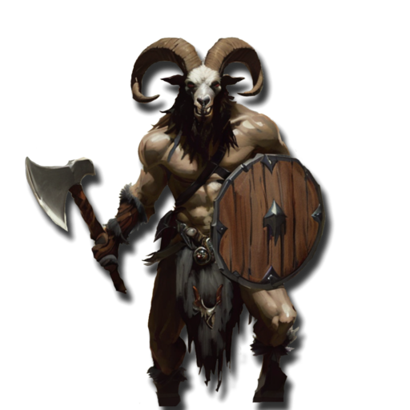

 <b> Cost per Model:</b > 7 pts 
 <b> Unit Size: </b>: 10-21 

 Infantry

Mongrel Pack

 
Hand Weapon and Shield+1 Defense. Charge Bonus: +1 Power
, 
AmbusherUnit can be deployed anywhere on it's owners side of the table.
, 
ScoutIgnore movement penalties from Difficult Terrain
 

                

                 
3
3 
3
1
1
6
Skill
Power
Defense
Attacks
Wounds
Discipline

 <b> Cost per Model:</b > 6 pts 
 <b> Unit Size: </b>: 15-25 

 Infantry

Mongrel Spear

 
Spear and Shield+1 Defense. Extra Rank supporting attacks when not charging.
, 
AmbusherUnit can be deployed anywhere on it's owners side of the table.
, 
ScoutIgnore movement penalties from Difficult Terrain
 

                

                 
3
3 
3
1
1
6
Skill
Power
Defense
Attacks
Wounds
Discipline

 <b> Cost per Model:</b > 6 pts 
 <b> Unit Size: </b>: 15-25 

 
Raiders
Min: 0 Max: 2

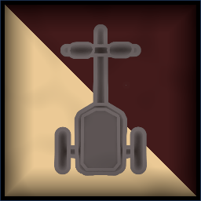
 Chariot

Raiding Chariot

 
Hand WeaponCharge Bonus: +1 Power
, 
Crushing ChargeCharge Bonus: +2 Power +2 Attacks
, 
AmbusherUnit can be deployed anywhere on it's owners side of the table.
 

                

                 
3
4 
4
4
5
7
Skill
Power
Defense
Attacks
Wounds
Discipline

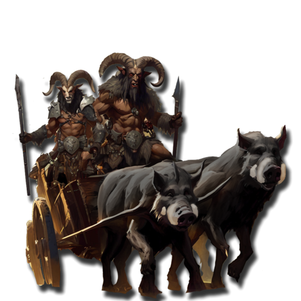

 <b> Cost per Model:</b > 55 pts 
 <b> Unit Size: </b>: 1 <b> Max Count: </b>: 2 

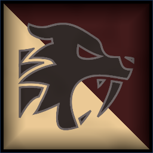
 Cavalry

Feral Hounds

 
FangsCharge Bonus: +1 Power
 

                

                 
3
4 
3
2
1
6
Skill
Power
Defense
Attacks
Wounds
Discipline

 <b> Cost per Model:</b > 11 pts 
 <b> Unit Size: </b>: 5 <b> Max Count: </b>: 2 

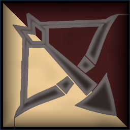
 Infantry

Mongrel Skirmishers

 
ShortbowsRange: 20. Power 3.
, 
AmbusherUnit can be deployed anywhere on it's owners side of the table.
, 
ScoutIgnore movement penalties from Difficult Terrain
 

                

                 
3
3 
3
1
1
6
Skill
Power
Defense
Attacks
Wounds
Discipline

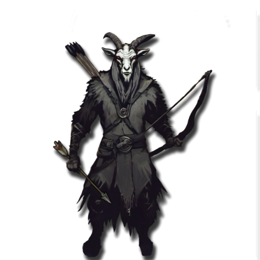

 <b> Cost per Model:</b > 7 pts 
 <b> Unit Size: </b>: 10-15 

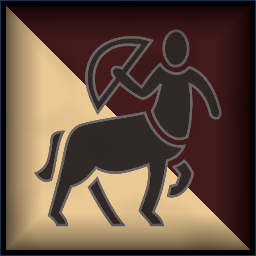
 Cavalry

Centaurs

 
Hand Weapon and Shield+1 Defense. Charge Bonus: +1 Power
 or 
Greatweapon+1 Power. Charge Bonus: +1 Power.
, 
JavelinsRange: 8. Power 3.
 or 
Shortbows (1 pts)Range: 20. Power 3.
, Magic Banner (up to 100pts) 

                

                 
3
4 
3
2
2
7
Skill
Power
Defense
Attacks
Wounds
Discipline

 <b> Cost per Model:</b > 17 pts 
 <b> Unit Size: </b>: 5-10 

 
Wild Beasts
Min: 0 Max: 1

 Monstrous Infantry

Minotaurs

 
Two Hand Weapons+1 Attack
 or 
Greatweapon+1 Power. Charge Bonus: +1 Power.
, 
FrenzyRe-roll missed Attack Rolls in the first round of combat.
 

                

                 
4
5 
4
3
3
7
Skill
Power
Defense
Attacks
Wounds
Discipline

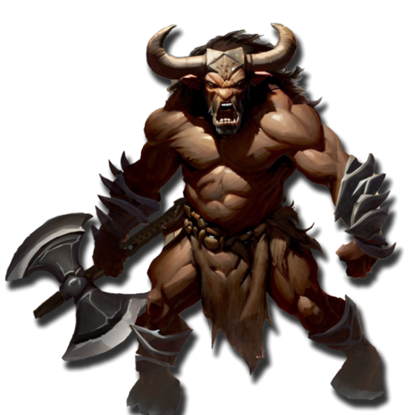

 <b> Cost per Model:</b > 38 pts 
 <b> Unit Size: </b>: 3-4 <b> Max Count: </b>: 1 

 Infantry Large

Harpies

 
ClawsCharge Bonus: +1 Power
, 
FlyingFly Speed 20. Ignore Terrain.
 

                

                 
3
4 
3
2
2
7
Skill
Power
Defense
Attacks
Wounds
Discipline

 <b> Cost per Model:</b > 18 pts 
 <b> Unit Size: </b>: 5-10 

 Large Monster

Feral Giant

 
ClawsCharge Bonus: +1 Power
, 
Boulder Throw (15 pts)Throw a boulder at an enemy unit. Range 18, 2D3 Power 5.
, 
FearlessIgnores all penalties to Discipline tests.
 

                

                 
3
6 
6
5
8
8
Skill
Power
Defense
Attacks
Wounds
Discipline

 <b> Cost per Model:</b > 90 pts 
 <b> Unit Size: </b>: 1 <b> Max Count: </b>: 1 

