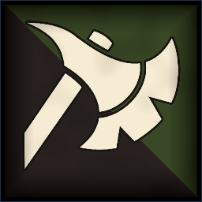
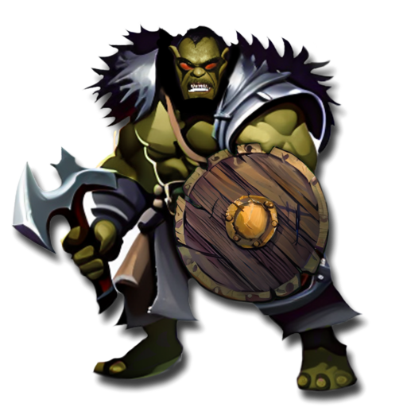
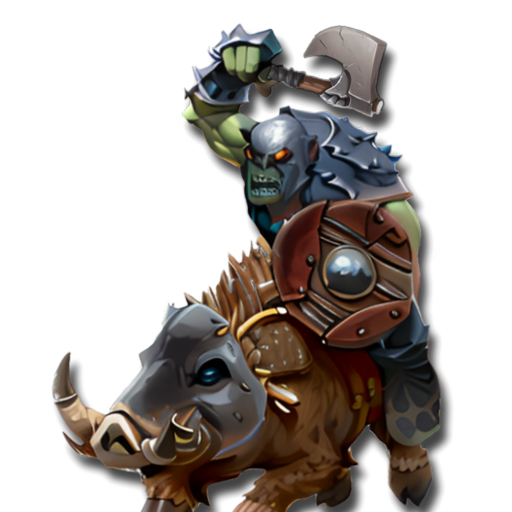
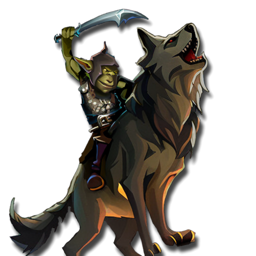
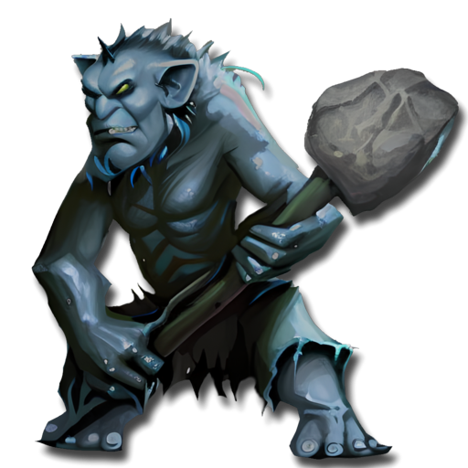
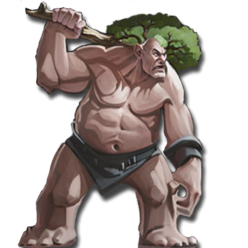

 <link rel="stylesheet" href="../../style.css">
 <link rel = "stylesheet" href = "factionSource.css">
# Greenskin Tribes #
 
Commanders
Min: 1 Max: 1

 Infantry Large

War Chief

 Hand Weapon and Shield(0) or Greatweapon(10) or Two Hand Weapons(5) 

                

                 
4
4 
4
3
3
7
Skill
Power
Defense
Attacks
Wounds
Discipline

 <b> Cost:</b > 50 pts 
 <b> Retinue: </b> orcWarriors

 
Battle Line
Min: 1 Max: 5

 Infantry Large

Orc Warriors

 Hand Weapon and Shield(0) or Two Hand Weapons(0) 

                

                 
3
4 
3
1
1
6
Skill
Power
Defense
Attacks
Wounds
Discipline

 <b> Cost per Model:</b > 6 pts 
 <b> Unit Size: </b>: {size.minCount} - {size.maxCount} 

 Infantry Large

Orc Brutes

 Greatweapon, Heavy Armor 

                

                 
4
4 
4
1
1
7
Skill
Power
Defense
Attacks
Wounds
Discipline

 <b> Cost per Model:</b > 13 pts 
 <b> Unit Size: </b>: {size.minCount} - {size.maxCount} <b> Max Count: </b>: 1 

 Infantry

Goblin Mob

 Spear and Shield(0) or Hand Weapon and Shield(0) 

                

                 
2
3 
2
1
1
6
Skill
Power
Defense
Attacks
Wounds
Discipline

 <b> Cost per Model:</b > 4 pts 
 <b> Unit Size: </b>: {size.minCount} - {size.maxCount} <b> Max Count: </b>: 1 

 
Raiders
Min: 0 Max: 1

 Cavalry

Boar Riders

 Hand Weapon and Shield 

                

                 
3
4 
3
2
2
6
Skill
Power
Defense
Attacks
Wounds
Discipline

 <b> Cost per Model:</b > 18 pts 
 <b> Unit Size: </b>: {size.minCount} - {size.maxCount} 

 Cavalry

Goblin Wolf Riders

 Hand Weapon and Shield, Shortbow 

                

                 
2
3 
2
2
2
6
Skill
Power
Defense
Attacks
Wounds
Discipline

 <b> Cost per Model:</b > 10 pts 
 <b> Unit Size: </b>: {size.minCount} - {size.maxCount} <b> Max Count: </b>: 1 

 
Big Stuff
Min: 0 Max: 1

 Monstrous Infantry

Trolls

 Unarmed 

                

                 
3
4 
5
3
3
6
Skill
Power
Defense
Attacks
Wounds
Discipline

 <b> Cost per Model:</b > 25 pts 
 <b> Unit Size: </b>: {size.minCount} - {size.maxCount} <b> Max Count: </b>: 1 

 Large Monster

Giant

 Unarmed 

                

                 
3
6 
6
4
8
7
Skill
Power
Defense
Attacks
Wounds
Discipline

 <b> Cost per Model:</b > 100 pts 
 <b> Unit Size: </b>: 1 <b> Max Count: </b>: 1 

