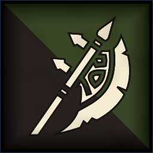
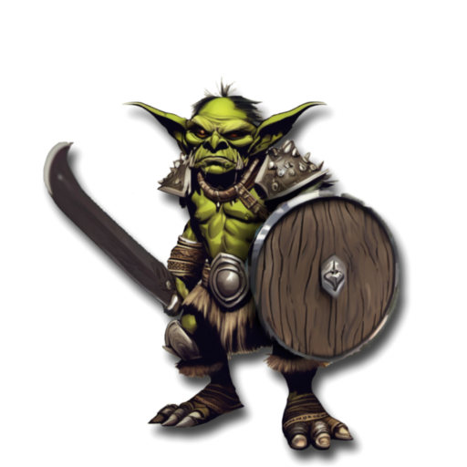
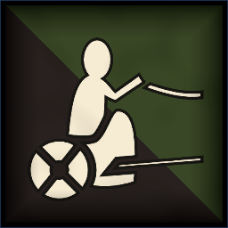
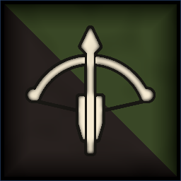
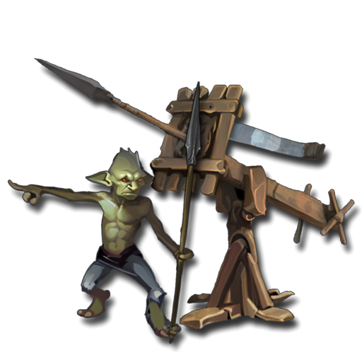
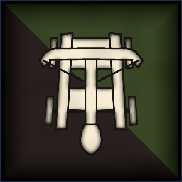
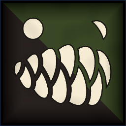
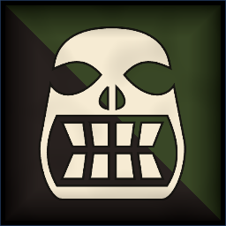

 <link rel="stylesheet" href="../../style.css">
 <link rel = "stylesheet" href = "factionSource.css">
# Greenskin Tribes #
 
Commanders
Min: 1 Max: 1

 Infantry Large

War Chief

 
Hand Weapon and Shield+1 Defense. Charge Bonus: +1 Power
 or 
Greatweapon (5 pts)+1 Power. Charge Bonus: +1 Power.
 or 
Two Hand Weapons (5 pts)+1 Attack
, 
WarcryAll your units have +1 Power for one turn.
, Magic Weapon/Item 

                

                 
4
4 
4
3
3
7
Skill
Power
Defense
Attacks
Wounds
Discipline

 <b> Cost:</b > 50 pts 

<b>Retinue Options: </b> Orc Warriors, Orc Brutes, Boar Riders, Orc Chariot, Wyvern

 Infantry

Goblin Shaman

 Spellcaster(2), Magic Item 

                

                 
3
3 
3
2
3
6
Skill
Power
Defense
Attacks
Wounds
Discipline

 <b> Cost:</b > 50 pts 

<b>Retinue Options: </b> Goblin Shortbows, Goblin Mob, Goblin Spear Mob, Goblin Wolf Riders, Orc Chariot, Giant Spider
<b>Spell Options: </b> Primal Fury, Thousand Mouths, Shadow Bolt, Hex Of Ruin, Shroud

 Infantry Large

Goblin King

 
Hand Weapon and Shield+1 Defense. Charge Bonus: +1 Power
 or 
Greatweapon (5 pts)+1 Power. Charge Bonus: +1 Power.
 or 
Two Hand Weapons (5 pts)+1 Attack
, 
Power Of ManyAll your Goblins are Fearless for one turn. Activate once per battle. 
, Magic Weapon/Item 

                

                 
4
4 
3
3
3
7
Skill
Power
Defense
Attacks
Wounds
Discipline

 <b> Cost:</b > 40 pts 

<b>Retinue Options: </b> Goblin Mob, Goblin Spear Mob, Goblin Wolf Riders, Orc Chariot, Goblin Shortbows, Giant Spider

 
Mounts

 Monstrous Infantry

Wyvern

 
FangsCharge Bonus: +1 Power
, 
FlyingFly Speed 20. Ignore Terrain.
 

                

                 
3
5 
5
4
5
6
Skill
Power
Defense
Attacks
Wounds
Discipline

 <b> Cost per Model:</b > 55 pts 
 <b> Unit Size: </b>: 1 

 Large Monster Long Base

Giant Spider

 
FangsCharge Bonus: +1 Power
, 
FearlessIgnores all penalties to Discipline tests.
, 
ScoutIgnore movement penalties from Difficult Terrain
, 
Poisoned AttacksEnemies re-roll 6s on Damage Saves.
, 
WebTarget a unit within 8. Reduce it's movement speed to 0 this turn. 
 

                

                 
4
4 
5
5
6
7
Skill
Power
Defense
Attacks
Wounds
Discipline

 <b> Cost per Model:</b > 60 pts 
 <b> Unit Size: </b>: 1 

 
Battle Line
Min: 1 Max: 3

 Infantry Large

Orc Warriors

 
Hand Weapon and Shield+1 Defense. Charge Bonus: +1 Power
 or 
Two Hand Weapons (1 pts)+1 Attack
, Magic Banner (up to 50pts) 

                

                 
3
4 
3
1
1
6
Skill
Power
Defense
Attacks
Wounds
Discipline

 <b> Cost per Model:</b > 7 pts 
 <b> Unit Size: </b>: 10-20 

 Infantry Large

Orc Brutes

 
Greatweapon+1 Power. Charge Bonus: +1 Power.
, 
Heavy Armor-1 Movement. +1 Defense
, Magic Banner (up to 100pts) 

                

                 
3
4 
4
1
1
7
Skill
Power
Defense
Attacks
Wounds
Discipline

 <b> Cost per Model:</b > 10 pts 
 <b> Unit Size: </b>: 10-18 <b> Max Count: </b>: 1 

 Infantry

Goblin Mob

 
Hand Weapon and Shield+1 Defense. Charge Bonus: +1 Power
, Magic Banner (up to 50pts) 

                

                 
3
3 
2
1
1
5
Skill
Power
Defense
Attacks
Wounds
Discipline

 <b> Cost per Model:</b > 4 pts 
 <b> Unit Size: </b>: 15-25 <b> Max Count: </b>: 2 

 Infantry

Goblin Spear Mob

 
Spear and Shield+1 Defense. Extra Rank supporting attacks when not charging.
, Magic Banner (up to 50pts) 

                

                 
3
3 
2
1
1
5
Skill
Power
Defense
Attacks
Wounds
Discipline

 <b> Cost per Model:</b > 4 pts 
 <b> Unit Size: </b>: 15-25 <b> Max Count: </b>: 2 

 
Raiders
Min: 0 Max: 1

 Cavalry

Boar Riders

 
Hand Weapon and Shield+1 Defense. Charge Bonus: +1 Power
, Magic Banner (up to 100pts) 

                

                 
3
4 
4
2
2
6
Skill
Power
Defense
Attacks
Wounds
Discipline

 <b> Cost per Model:</b > 19 pts 
 <b> Unit Size: </b>: 5-10 

 Cavalry

Goblin Wolf Riders

 
Hand Weapon and Shield+1 Defense. Charge Bonus: +1 Power
, 
Shortbows (2 pts)Range: 20. Power 3.
, 
Swift+1 Movement
, Magic Banner (up to 50pts) 

                

                 
3
3 
2
2
2
5
Skill
Power
Defense
Attacks
Wounds
Discipline

 <b> Cost per Model:</b > 12 pts 
 <b> Unit Size: </b>: 5-10 <b> Max Count: </b>: 1 

 Chariot

Orc Boar Chariot

 
Hand WeaponCharge Bonus: +1 Power
, 
Crushing ChargeCharge Bonus: +2 Power +2 Attacks
 

                

                 
3
4 
5
3
5
6
Skill
Power
Defense
Attacks
Wounds
Discipline

 <b> Cost per Model:</b > 55 pts 
 <b> Unit Size: </b>: 1 <b> Max Count: </b>: 1 

 
Ranged Support
Min: 0 Max: 1

 Infantry

Goblin Shortbows

 
ShortbowsRange: 20. Power 3.
, Magic Banner (up to 50pts) 

                

                 
3
3 
2
1
1
5
Skill
Power
Defense
Attacks
Wounds
Discipline

 <b> Cost per Model:</b > 6 pts 
 <b> Unit Size: </b>: 15-20 <b> Max Count: </b>: 2 

 War Machine

Goblin Bolt Throwers

 
Bolt ThrowerRange 48. 3x Power 6.
, 
Lethal ShotsThis units ranged attack deals 2x wounds against multiwound targets.
, 
Protected CrewUnit counts as being in Cover. (-1 to Ranged attack rolls against it).
, 
Reposition+6 Movement this turn.
 

                

                 
3
3 
4
2
5
5
Skill
Power
Defense
Attacks
Wounds
Discipline

 <b> Cost per Model:</b > 40 pts 
 <b> Unit Size: </b>: 1 <b> Max Count: </b>: 2 

 War Machine

Goblin Stonethrower

 
CatapultRange 48. 2D3 hits, Power 5.
, 
Protected CrewUnit counts as being in Cover. (-1 to Ranged attack rolls against it).
, 
Reposition+6 Movement this turn.
 

                

                 
3
3 
4
2
5
5
Skill
Power
Defense
Attacks
Wounds
Discipline

 <b> Cost per Model:</b > 50 pts 
 <b> Unit Size: </b>: 1 

 
Big Stuff
Min: 0 Max: 1

 Monstrous Infantry

Trolls

 
Greatweapon+1 Power. Charge Bonus: +1 Power.
, 
RegenerationUnit recovers all missing wounds at end of turn.
 

                

                 
3
4 
5
3
3
6
Skill
Power
Defense
Attacks
Wounds
Discipline

 <b> Cost per Model:</b > 30 pts 
 <b> Unit Size: </b>: 3-4 <b> Max Count: </b>: 1 

 Large Monster

Giant

 
Hand WeaponCharge Bonus: +1 Power
, 
FearlessIgnores all penalties to Discipline tests.
 

                

                 
3
6 
6
5
8
9
Skill
Power
Defense
Attacks
Wounds
Discipline

 <b> Cost per Model:</b > 100 pts 
 <b> Unit Size: </b>: 1 <b> Max Count: </b>: 1 

