 <link rel="stylesheet" href="../../style.css">
 <link rel = "stylesheet" href = "factionSource.css">
# Knights of Avalon #
 
Commanders
Min: 1 Max: 1

 Infantry

Maiden

 Spellcaster(2), Magic Item, 
Aura of ProtectionMaiden and retinue rerolls 1s on Damage Saves.
 

                

                 
4
3 
3
2
3
8
Skill
Power
Defense
Attacks
Wounds
Discipline

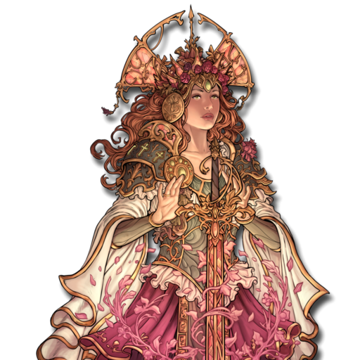

 <b> Cost:</b > 60 pts 

<b>Retinue Options: </b> Knight Aspirants, Sword Militia, Halberd Militia, Spear Militia, Longbowmen, Pegasus, Unicorn
<b>Spell Options: </b> Divine Favour, Radiant Shield, Frost Ward, Shroud, Arcane Web

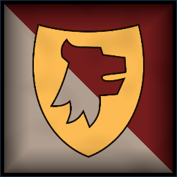
 Infantry Large

Paladin

 
Hand Weapon and Shield+1 Defense. Charge Bonus: +1 Power
 or 
Lance and Shield (5 pts)+1 Defense. Charge Bonus: +2 Power
 or 
Greatweapon (5 pts)+1 Power. Charge Bonus: +1 Power.
, 
Heavy Armor-1 Movement. +1 Defense
, Spellcaster(2), Magic Weapon/Item, 
Aura of VengeancePaladin and retinue rerolls 1s on Attack Rolls.
 

                

                 
4
4 
3
3
3
9
Skill
Power
Defense
Attacks
Wounds
Discipline

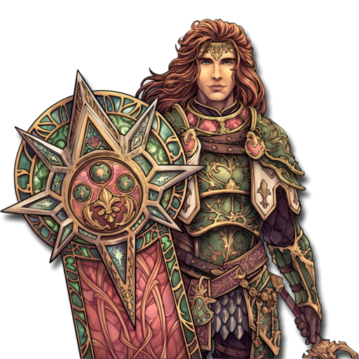

 <b> Cost:</b > 50 pts 

<b>Retinue Options: </b> Knight Aspirants, Sworn Knights, Kings Guard, Pegasus, Hippogryph
<b>Spell Options: </b> Holy Blade, Divine Favour, Shroud

 
Mounts

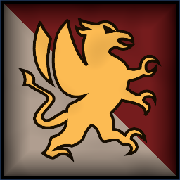
 Monstrous Infantry

Hippogryph

 
ClawsCharge Bonus: +1 Power
, 
FlyingFly Speed 20. Ignore Terrain.
 

                

                 
4
5 
5
3
5
8
Skill
Power
Defense
Attacks
Wounds
Discipline

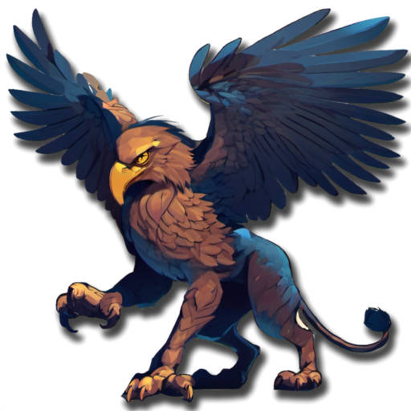

 <b> Cost per Model:</b > 55 pts 
 <b> Unit Size: </b>: 1 <b> Max Count: </b>: 1 

 Monstrous Infantry

Pegasus

 
HoovesCharge Bonus: +1 Power
, 
FlyingFly Speed 20. Ignore Terrain.
 

                

                 
3
4 
4
3
4
8
Skill
Power
Defense
Attacks
Wounds
Discipline

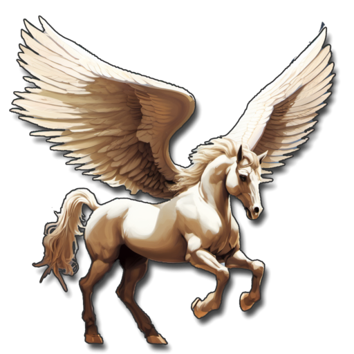

 <b> Cost per Model:</b > 40 pts 
 <b> Unit Size: </b>: 1 <b> Max Count: </b>: 1 

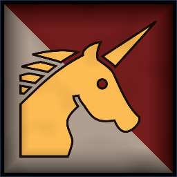
 Monstrous Infantry

Unicorn

 
HoovesCharge Bonus: +1 Power
, 
FeyReroll all sucessful Attack and Ranged Attack rolls against this unit.
Ignores Difficult Terrain. 
, 
Swift+1 Movement
 

                

                 
4
4 
4
3
5
9
Skill
Power
Defense
Attacks
Wounds
Discipline

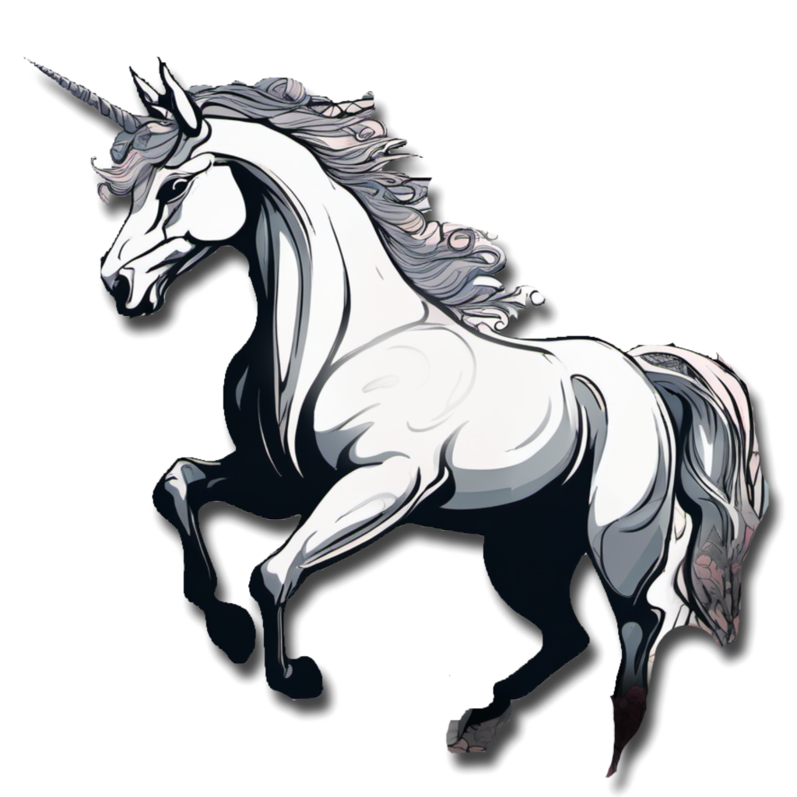

 <b> Cost per Model:</b > 35 pts 
 <b> Unit Size: </b>: 1 

 
Battle Line
Min: 1 Max: 3

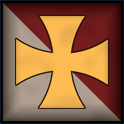
 Infantry

Sword Militia

 
Hand Weapon and Shield+1 Defense. Charge Bonus: +1 Power
, Magic Banner (up to 50pts) 

                

                 
3
3 
3
1
1
7
Skill
Power
Defense
Attacks
Wounds
Discipline

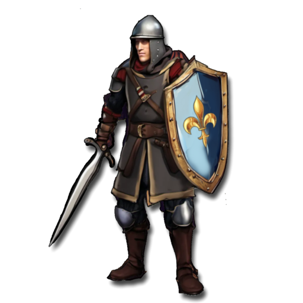

 <b> Cost per Model:</b > 6 pts 
 <b> Unit Size: </b>: 10-21 

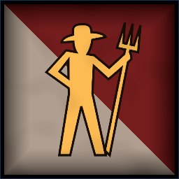
 Infantry

Peasant Mob

 
Hand WeaponCharge Bonus: +1 Power
, Magic Banner (up to 50pts) 

                

                 
2
3 
3
1
1
6
Skill
Power
Defense
Attacks
Wounds
Discipline

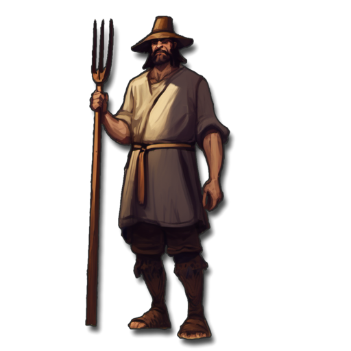

 <b> Cost per Model:</b > 4 pts 
 <b> Unit Size: </b>: 15-21 

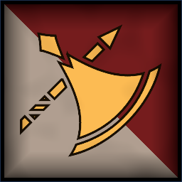
 Infantry

Halberd Militia

 
HalberdDamage Saves against this weapon are never better than 4+.
, Magic Banner (up to 50pts) 

                

                 
3
3 
3
1
1
7
Skill
Power
Defense
Attacks
Wounds
Discipline

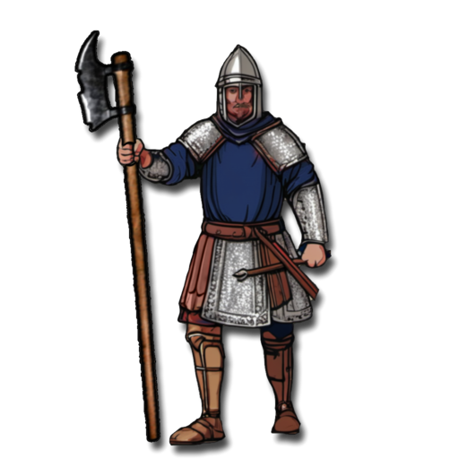

 <b> Cost per Model:</b > 6 pts 
 <b> Unit Size: </b>: 10-21 

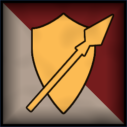
 Infantry

Spear Militia

 
Spear and Shield+1 Defense. Extra Rank supporting attacks when not charging.
, Magic Banner (up to 50pts) 

                

                 
3
3 
3
1
1
7
Skill
Power
Defense
Attacks
Wounds
Discipline

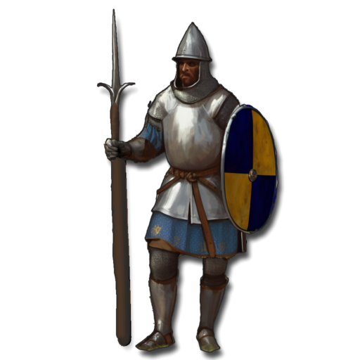

 <b> Cost per Model:</b > 6 pts 
 <b> Unit Size: </b>: 10-21 

 
Fast Attack
Min: 0 Max: 2

 Cavalry Lance

Knight Aspirants

 
Lance and Shield+1 Defense. Charge Bonus: +2 Power
, 
Heavy Armor-1 Movement. +1 Defense
, Magic Banner (up to 50pts), 
Horse MastersIgnores movement penalty from Heavy Armor.
When deployed 3 wide, models in flanks can attack as if in the front rank.
 

                

                 
3
3 
3
2
2
7
Skill
Power
Defense
Attacks
Wounds
Discipline

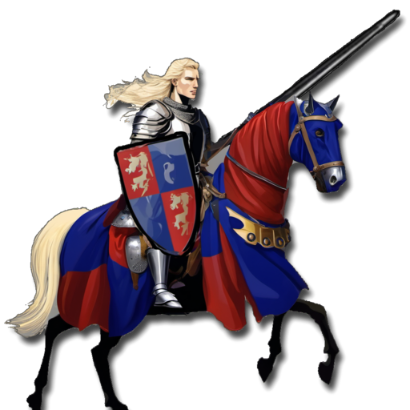

 <b> Cost per Model:</b > 18 pts 
 <b> Unit Size: </b>: 6-9 

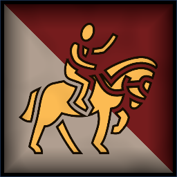
 Cavalry

Mounted Hunters

 
Hand WeaponCharge Bonus: +1 Power
, 
ShortbowsRange: 20. Power 3.
, 
AmbusherUnit can be deployed anywhere on its owners side of the table.
 

                

                 
3
3 
3
2
2
7
Skill
Power
Defense
Attacks
Wounds
Discipline

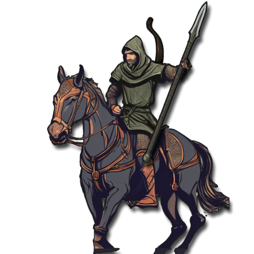

 <b> Cost per Model:</b > 19 pts 
 <b> Unit Size: </b>: 5-10 

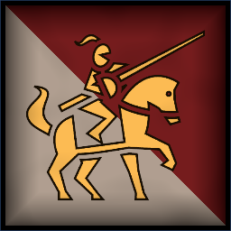
 Cavalry Lance

Sworn Knights

 
Lance and Shield+1 Defense. Charge Bonus: +2 Power
, 
Heavy Armor-1 Movement. +1 Defense
, Magic Banner (up to 100pts), 
BodyguardIf a Commander is part of this unit it re-rolls failed Discipline tests.
, 
Horse MastersIgnores movement penalty from Heavy Armor.
When deployed 3 wide, models in flanks can attack as if in the front rank.
 

                

                 
4
3 
3
2
2
8
Skill
Power
Defense
Attacks
Wounds
Discipline

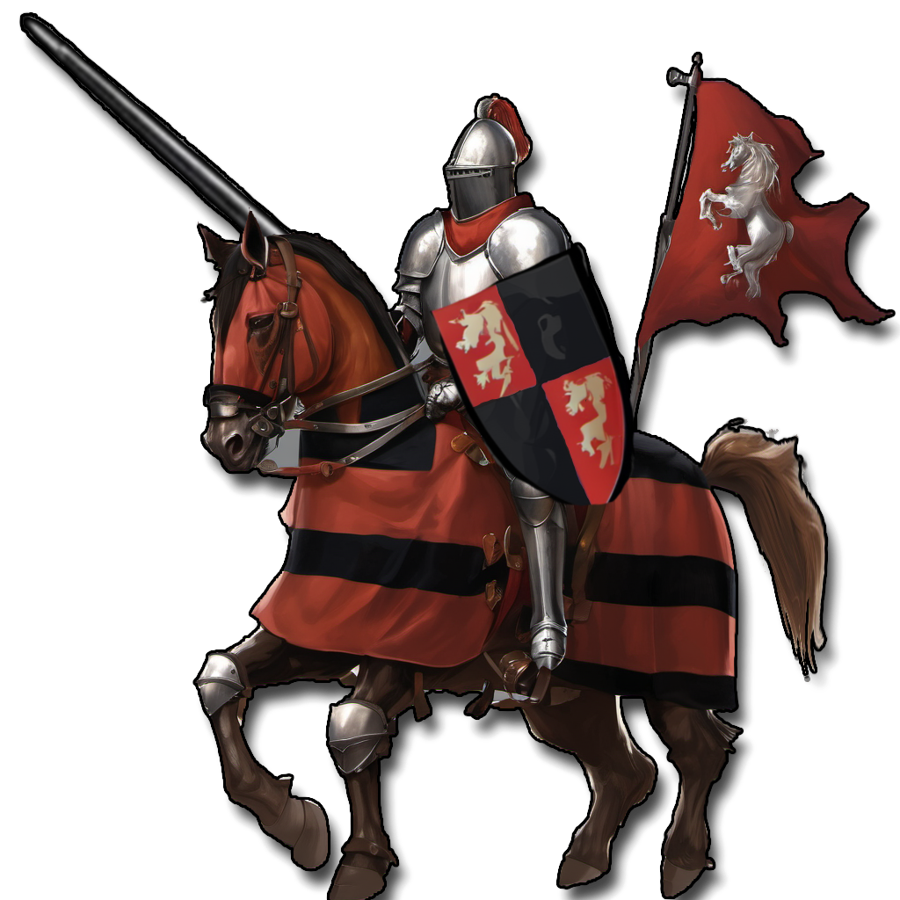

 <b> Cost per Model:</b > 20 pts 
 <b> Unit Size: </b>: 6-9 

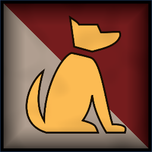
 Hounds

Hunting Dogs

 
FangsCharge Bonus: +1 Power
 

                

                 
3
3 
3
1
1
5
Skill
Power
Defense
Attacks
Wounds
Discipline

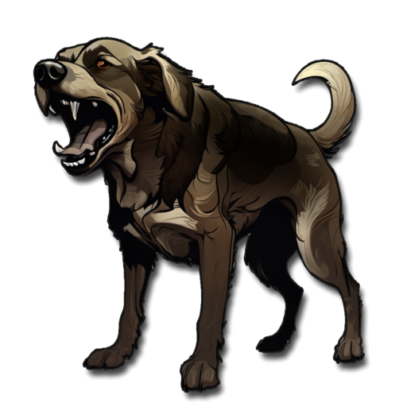

 <b> Cost per Model:</b > 6 pts 
 <b> Unit Size: </b>: 5-10 <b> Max Count: </b>: 2 

 
Ranged Support
Min: 0 Max: 1

 Infantry

Hunters

 
Hand WeaponCharge Bonus: +1 Power
, 
ShortbowsRange: 20. Power 3.
, 
ScoutIgnore movement penalties from Difficult Terrain
, 
AmbusherUnit can be deployed anywhere on its owners side of the table.
 

                

                 
3
3 
3
1
1
7
Skill
Power
Defense
Attacks
Wounds
Discipline

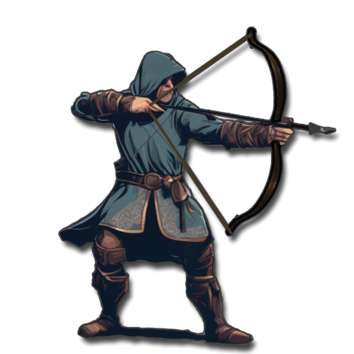

 <b> Cost per Model:</b > 7 pts 
 <b> Unit Size: </b>: 10-15 

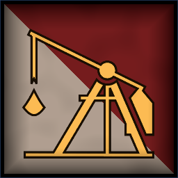
 War Machine

Trebuchet

 
CatapultRange 48. 2D3 hits, Power 5.
, 
Crewed WeaponAlways counts as being in Cover. -2 Defense in Close Combat. Unit can't charge.
, 
Reposition+6 Movement this turn.
 

                

                 
3
3 
5
2
5
7
Skill
Power
Defense
Attacks
Wounds
Discipline

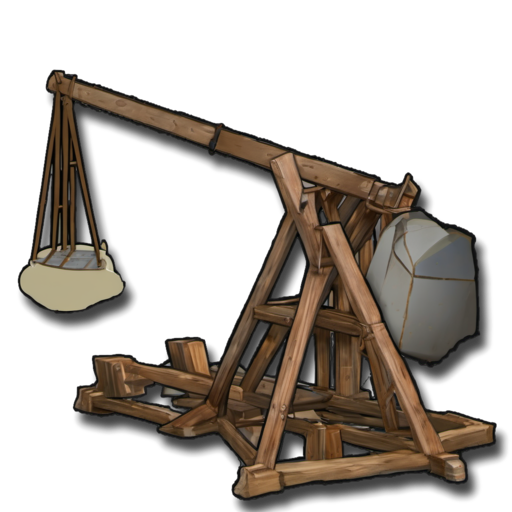

 <b> Cost per Model:</b > 55 pts 
 <b> Unit Size: </b>: 1 <b> Max Count: </b>: 1 

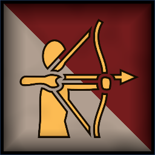
 Infantry

Longbowmen

 
LongbowsRange: 30. Power 3.
, Magic Banner (up to 50pts) 

                

                 
3
3 
3
1
1
7
Skill
Power
Defense
Attacks
Wounds
Discipline

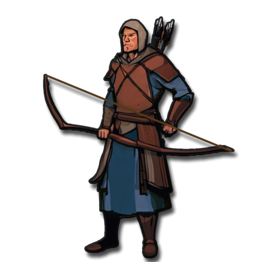

 <b> Cost per Model:</b > 8 pts 
 <b> Unit Size: </b>: 10-15 

 
Elites
Min: 0 Max: 1

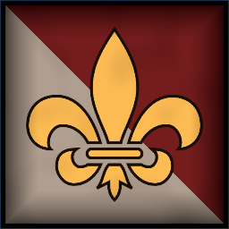
 Cavalry Lance

Kings Guard

 
Lance and Shield+1 Defense. Charge Bonus: +2 Power
, 
Heavy Armor-1 Movement. +1 Defense
, Magic Banner (up to 100pts), 
BodyguardIf a Commander is part of this unit it re-rolls failed Discipline tests.
, 
Horse MastersIgnores movement penalty from Heavy Armor.
When deployed 3 wide, models in flanks can attack as if in the front rank.
, 
FearlessIgnores all penalties to Discipline tests.
 

                

                 
5
4 
4
2
2
9
Skill
Power
Defense
Attacks
Wounds
Discipline

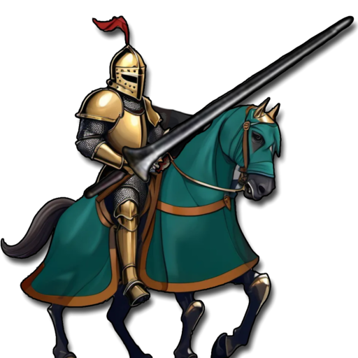

 <b> Cost per Model:</b > 25 pts 
 <b> Unit Size: </b>: 6 <b> Max Count: </b>: 1 

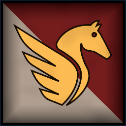
 Monstrous Infantry

Pegasus Knights

 
Lance and Shield+1 Defense. Charge Bonus: +2 Power
, 
FlyingFly Speed 20. Ignore Terrain.
, Magic Banner (up to 100pts), 
Heavy Armor-1 Movement. +1 Defense
 

                

                 
4
3 
3
3
2
8
Skill
Power
Defense
Attacks
Wounds
Discipline

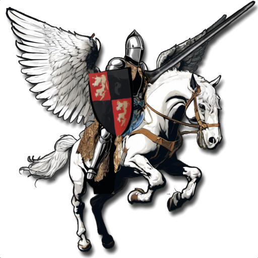

 <b> Cost per Model:</b > 28 pts 
 <b> Unit Size: </b>: 3-4 <b> Max Count: </b>: 1 

