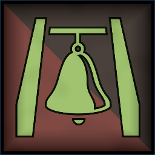
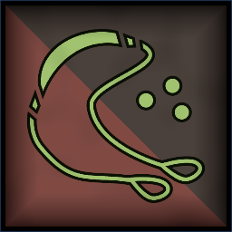

 <link rel="stylesheet" href="../../style.css">
 <link rel = "stylesheet" href = "factionSource.css">
# Ratkin Clans #
 
Commanders
Min: 1 Max: 1

 Infantry

Ratkin Warlock

 
Hand WeaponCharge Bonus: +1 Power
, Magic Item, Spellcaster(2), 
Swift+1 Movement
 

                

                 
3
3 
3
2
3
6
Skill
Power
Defense
Attacks
Wounds
Discipline

 <b> Cost:</b > 60 pts 

<b>Retinue Options: </b> Ratkin Slingers, Ratkin Conscripts, Ratkin Legionaries, Doom Bell
<b>Spell Options: </b> Hex Of Ruin, Shadow Bolt, Thousand Mouths, Primal Fury, Shroud

 Infantry

Ratkin Chieftain

 
Hand Weapon and Shield+1 Defense. Charge Bonus: +1 Power
 or 
Two Hand Weapons (5 pts)+1 Attack
 or 
Greatweapon (5 pts)+1 Power. Charge Bonus: +1 Power.
, 
Cruel MotivationRetinue gets +2 Movement Speed and re-rolls missed Attack Rolls for one Turn. It loses one model.
, Magic Weapon/Item, 
Swift+1 Movement
 

                

                 
4
4 
4
3
3
7
Skill
Power
Defense
Attacks
Wounds
Discipline

 <b> Cost:</b > 50 pts 

<b>Retinue Options: </b> Ratkin Conscripts, Ratkin Legionaires

 Infantry

Ratkin Infiltrator

 
Two Hand Weapons+1 Attack
, 
Deadly StrikeActivate once per battle. Melee attacks deal 2x wounds against multiwound targets for one turn.
, Magic Weapon/Item, 
Swift+1 Movement
, 
Poisoned AttacksEnemies re-roll 6s on Damage Saves.
, 
HiddenCommander is hidden from your opponent until engaged in combat or damaged.
 

                

                 
4
4 
3
3
3
6
Skill
Power
Defense
Attacks
Wounds
Discipline

 <b> Cost:</b > 50 pts 

<b>Retinue Options: </b> Ratkin Skulkers, Ratkin Slingers, Ratkin Conscripts, Ratkin Legionaries

 
Mounts

 War Wagon

Doom Bell

 
Doom BellAll your units have Frenzy (reroll failed Attack Rolls) this turn. Activate once per battle.
, 
Protected CrewUnit counts as being in Cover. (-1 to Ranged attack rolls against it).
, 
Crushing ChargeCharge Bonus: +2 Power +2 Attacks
 

                

                 
3
3 
5
2
8
6
Skill
Power
Defense
Attacks
Wounds
Discipline

 <b> Cost per Model:</b > 55 pts 
 <b> Unit Size: </b>: 1 

 
Battle Line
Min: 1 Max: 3

 Infantry

Ratkin Legionaries

 
HalberdDamage Saves against this weapon are never better than 4+.
, Magic Banner (up to 100pts), 
Heavy Armor-1 Movement. +1 Defense
, 
Swift+1 Movement
 

                

                 
4
3 
3
1
1
7
Skill
Power
Defense
Attacks
Wounds
Discipline

 <b> Cost per Model:</b > 8 pts 
 <b> Unit Size: </b>: 10-21 <b> Max Count: </b>: 1 

 Infantry

Ratkin Conscripts

 
Spear and Shield+1 Defense. Extra Rank supporting attacks when not charging.
 or 
Hand Weapon and Shield+1 Defense. Charge Bonus: +1 Power
, 
Swift+1 Movement
, Magic Banner (up to 50pts) 

                

                 
3
3 
2
1
1
6
Skill
Power
Defense
Attacks
Wounds
Discipline

 <b> Cost per Model:</b > 5 pts 
 <b> Unit Size: </b>: 15-25 

 Infantry

Ratkin Skulkers

 
Two Hand Weapons+1 Attack
, 
Throwing Stars (1 pts)Range: 8. Power 2.
, 
AmbusherUnit can be deployed anywhere on it's owners side of the table.
, 
ScoutIgnore movement penalties from Difficult Terrain
, 
Swift+1 Movement
 

                

                 
4
3 
2
1
1
6
Skill
Power
Defense
Attacks
Wounds
Discipline

 <b> Cost per Model:</b > 7 pts 
 <b> Unit Size: </b>: 10-21 <b> Max Count: </b>: 1 

 
Ranged Support
Min: 0 Max: 1

 Weapon Team

Ratkin Longrifles

 
LongrifleRange 48. Power 5.
, 
Swift+1 Movement
, 
Lethal ShotsThis units ranged attack deals 2x wounds against multiwound targets.
 

                

                 
4
3 
3
1
2
6
Skill
Power
Defense
Attacks
Wounds
Discipline

 <b> Cost per Model:</b > 20 pts 
 <b> Unit Size: </b>: 2-4 

 Infantry

Ratkin Slingers

 
SlingRange: 20. Power 2.
, Magic Banner (up to 50pts), 
Swift+1 Movement
 

                

                 
3
3 
2
1
1
6
Skill
Power
Defense
Attacks
Wounds
Discipline

 <b> Cost per Model:</b > 5 pts 
 <b> Unit Size: </b>: 15-20 <b> Max Count: </b>: 2 

 Weapon Team

Ratkin Flamers

 
FlamerRange 12. D3 Power 5.
, 
Swift+1 Movement
 

                

                 
3
3 
2
1
2
6
Skill
Power
Defense
Attacks
Wounds
Discipline

 <b> Cost per Model:</b > 20 pts 
 <b> Unit Size: </b>: 2-4 

 
Vermin
Min: 0 Max: 1

 Large Monster Long Base

Ratkin Monstrosity

 
ClawsCharge Bonus: +1 Power
, 
FearlessIgnores all penalties to Discipline tests.
, 
FrenzyRe-roll missed Attack Rolls in the first round of combat.
, 
Swift+1 Movement
 

                

                 
3
6 
6
6
6
6
Skill
Power
Defense
Attacks
Wounds
Discipline

 <b> Cost per Model:</b > 100 pts 
 <b> Unit Size: </b>: 1 <b> Max Count: </b>: 1 

 Monstrous Infantry

Ratkin Alphas

 
ClawsCharge Bonus: +1 Power
, 
Swift+1 Movement
 

                

                 
3
5 
4
3
3
5
Skill
Power
Defense
Attacks
Wounds
Discipline

 <b> Cost per Model:</b > 28 pts 
 <b> Unit Size: </b>: 3-4 <b> Max Count: </b>: 1 

 Swarm

Rat Swarms

 
ClawsCharge Bonus: +1 Power
, 
FearlessIgnores all penalties to Discipline tests.
, 
FrenzyRe-roll missed Attack Rolls in the first round of combat.
 

                

                 
2
1 
1
5
5
8
Skill
Power
Defense
Attacks
Wounds
Discipline

 <b> Cost per Model:</b > 26 pts 
 <b> Unit Size: </b>: 3-4 <b> Max Count: </b>: 1 

