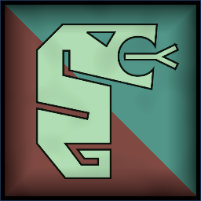
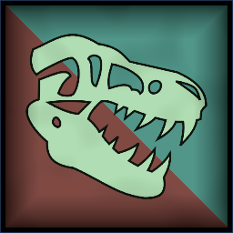
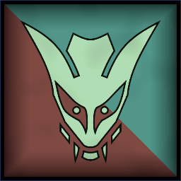
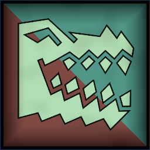
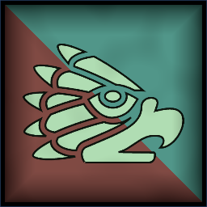
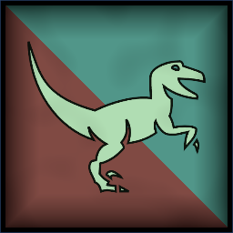
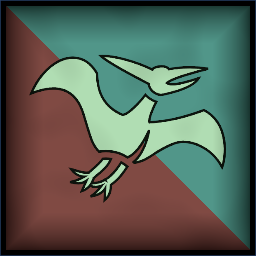
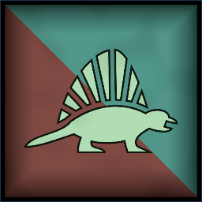

 <link rel="stylesheet" href="../../style.css">
 <link rel = "stylesheet" href = "factionSource.css">
# Reptilian Kingdoms #
 
Commanders
Min: 1 Max: 1

 Infantry

Newt Priest

 Spellcaster(2), Magic Item 

                

                 
3
3 
3
2
3
7
Skill
Power
Defense
Attacks
Wounds
Discipline

 <b> Cost:</b > 55 pts 

<b>Retinue Options: </b> Newt Braves, Newt Skirmishers, Pterodactyl Riders, Triceratops
<b>Spell Options: </b> Divine Favour, Arcane Web, Radiant Shield, Primal Fury, Fireball, Wildform

 Infantry Large

Saurian Warlord

 
Hand Weapon and Shield+1 Defense. Charge Bonus: +1 Power
 or 
Greatweapon (10 pts)+1 Power. Charge Bonus: +1 Power.
 or 
Two Hand Weapons (5 pts)+1 Attack
, 
WarcryAll your units have +1 Power for one turn.
, Magic Weapon/Item 

                

                 
4
4 
5
3
3
8
Skill
Power
Defense
Attacks
Wounds
Discipline

 <b> Cost:</b > 50 pts 

<b>Retinue Options: </b> Saurian Warriors, Saurian Spear, Raptor Riders, Tyrannosaur

 Infantry

Ancient Toad

 Spellcaster(2), Magic Item, 
Ancient KnowledgeRestore all used spell charges. 
 

                

                 
3
3 
5
2
5
9
Skill
Power
Defense
Attacks
Wounds
Discipline

 <b> Cost:</b > 70 pts 

<b>Retinue Options: </b> Saurian Warriors, Saurian Spear, Triceratops
<b>Spell Options: </b> Radiant Shield, Divine Favour, Arcane Web, Primal Fury, Fireball, Frost Ward, Fiery Blades

 
Mounts

 Large Monster Long Base

Tyrannosaur

 
FangsCharge Bonus: +1 Power
, 
FearlessIgnores all penalties to Discipline tests.
, 
Swift+1 Movement
 

                

                 
4
6 
5
6
6
7
Skill
Power
Defense
Attacks
Wounds
Discipline

 <b> Cost per Model:</b > 65 pts 
 <b> Unit Size: </b>: 1 

 
Battle Line
Min: 1 Max: 3

 Infantry Large

Saurian Warriors

 
Hand Weapon and Shield+1 Defense. Charge Bonus: +1 Power
, Magic Banner (up to 100pts) 

                

                 
3
4 
4
1
1
8
Skill
Power
Defense
Attacks
Wounds
Discipline

 <b> Cost per Model:</b > 10 pts 
 <b> Unit Size: </b>: 10-18 

 Monstrous Infantry

Crocolisk Bruisers

 
Greatweapon+1 Power. Charge Bonus: +1 Power.
, 
Scaly Skin-1 Movement. +1 Defense
 

                

                 
3
4 
4
3
3
8
Skill
Power
Defense
Attacks
Wounds
Discipline

 <b> Cost per Model:</b > 30 pts 
 <b> Unit Size: </b>: 3-6 <b> Max Count: </b>: 1 

 Infantry

Newt Braves

 
Hand Weapon and Shield+1 Defense. Charge Bonus: +1 Power
, 
Javelins (1 pts)Range: 8. Power 2.
, Magic Banner (up to 50pts), 
Swift+1 Movement
 

                

                 
3
2 
2
1
1
6
Skill
Power
Defense
Attacks
Wounds
Discipline

 <b> Cost per Model:</b > 4 pts 
 <b> Unit Size: </b>: 15-24 <b> Max Count: </b>: 2 

 Infantry Large

Saurian Spear

 
Spear and Shield+1 Defense. Extra Rank supporting attacks when not charging.
, Magic Banner (up to 100pts) 

                

                 
3
4 
4
1
1
8
Skill
Power
Defense
Attacks
Wounds
Discipline

 <b> Cost per Model:</b > 10 pts 
 <b> Unit Size: </b>: 10-18 

 
Fast Attack
Min: 0 Max: 1

 Cavalry

Raptor Riders

 
Hand Weapon and Shield+1 Defense. Charge Bonus: +1 Power
, Magic Banner (up to 100pts) 

                

                 
3
4 
4
2
2
8
Skill
Power
Defense
Attacks
Wounds
Discipline

 <b> Cost per Model:</b > 21 pts 
 <b> Unit Size: </b>: 5-10 

 Monstrous Infantry

Pterodactyl Riders

 
Hand WeaponCharge Bonus: +1 Power
, 
Shortbows (2 pts)Range: 20. Power 3.
, 
FlyingFly Speed 20. Ignore Terrain.
, Magic Banner (up to 50pts) 

                

                 
3
4 
3
3
2
7
Skill
Power
Defense
Attacks
Wounds
Discipline

 <b> Cost per Model:</b > 25 pts 
 <b> Unit Size: </b>: 3-4 <b> Max Count: </b>: 1 

 
Ranged Support
Min: 0 Max: 1

 Infantry

Newt Skirmishers

 
ShortbowsRange: 20. Power 3.
, Magic Banner (up to 50pts), 
Swift+1 Movement
, 
ScoutIgnore movement penalties from Difficult Terrain
 

                

                 
3
2 
2
1
1
6
Skill
Power
Defense
Attacks
Wounds
Discipline

 <b> Cost per Model:</b > 6 pts 
 <b> Unit Size: </b>: 10-20 

 Large Monster

Firelizard

 
FangsCharge Bonus: +1 Power
, 
Fire BreathRange 12. 2D3 Power 5.
 

                

                 
3
4 
4
4
5
7
Skill
Power
Defense
Attacks
Wounds
Discipline

 <b> Cost per Model:</b > 65 pts 
 <b> Unit Size: </b>: 1 <b> Max Count: </b>: 1 

 
Jungle Beasts
Min: 0 Max: 1

 Large Monster Long Base

Triceratops

 
HornsCharge Bonus: +1 Power, +1 Attack
, 
Newt ShortbowsRange: 20. 4x Power 3.
, 
FearlessIgnores all penalties to Discipline tests.
 

                

                 
3
5 
7
4
8
9
Skill
Power
Defense
Attacks
Wounds
Discipline

 <b> Cost per Model:</b > 110 pts 
 <b> Unit Size: </b>: 1 <b> Max Count: </b>: 1 

 Swarm

Jungle Swarm

 
FangsCharge Bonus: +1 Power
, 
Poisoned AttacksEnemies re-roll 6s on Damage Saves.
, 
FearlessIgnores all penalties to Discipline tests.
 

                

                 
2
2 
2
5
5
10
Skill
Power
Defense
Attacks
Wounds
Discipline

 <b> Cost per Model:</b > 28 pts 
 <b> Unit Size: </b>: 3 <b> Max Count: </b>: 1 

