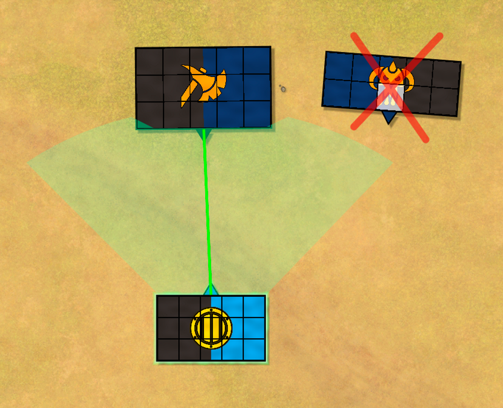
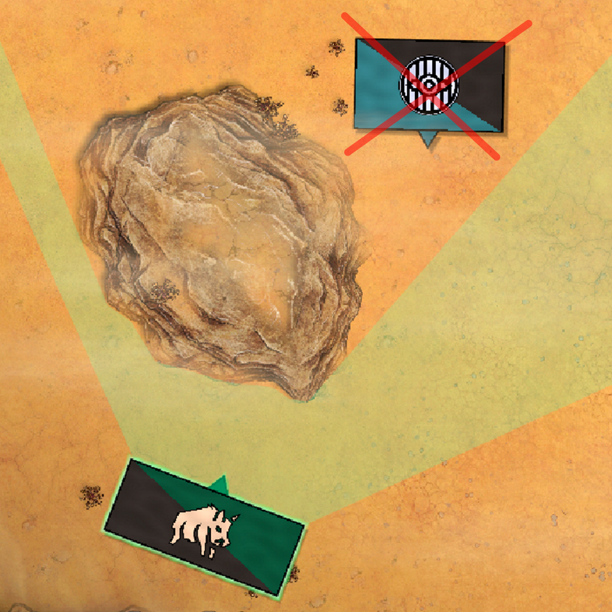
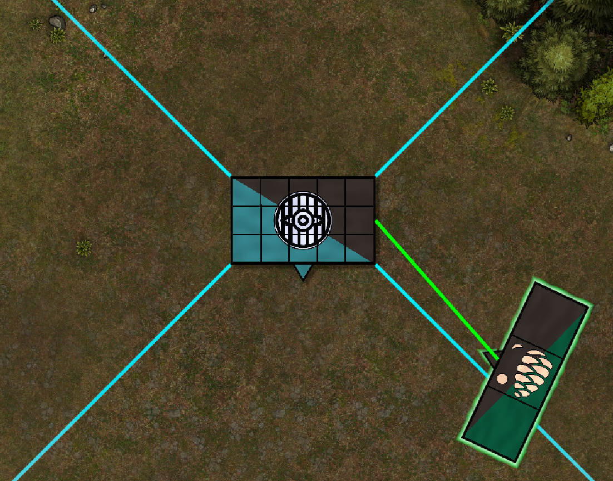
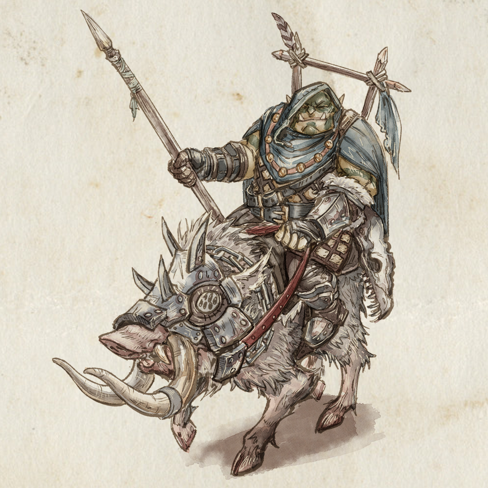

<link rel="stylesheet" href="../../style.css">

In the **Charge Phase** players send their warriors into melee combat with the enemy. Charges are declared and resolved and units are moved into base contact.

Players take turns using Alternating Activations to declare one charge at a time, until both players pass.

## Declaring a Charge
To declare a charge pick a unit that is a **Valid Charger**, then select one enemy unit that is a **Valid Target** for the charge.

A **Valid Charger** is any one of your units that has not been activated this turn, is not fleeing and has not already declared a charge. Also, a unit that *already has a charge declared against it* is not a **Valid Charger**. It has to focus on the incoming threat! See **Counter Charge** below for an exception to this.  

An enemy unit is a **Valid Target** if it is within range and **Line of Sight** of the charger. Charge range is the same as the units movement speed and is measured from the front center of the charger to the center of the side of the target being charged. Line of Sight is a 45° arc from the front of the unit. 

Left unit is inside LoS arc and in range. Right unit is too far away! 

The target is in charge range of the cavalry, but hidden behind the cliff. Not a valid charge. 

  

A unit that has already declared a charge this turn is not a **Valid Target**. **Counter Charge** and **Charge Intercept** are two exceptions to this.

For a charge to be valid there also needs to be enough space in base contact to place the charger.

## Charge Side
 A charge is always declared against either the **Front**, **Rear**, **Left** **Flank**, or **Right Flank** of the target unit. To determine the Charge Side check wich side arc contains a majority of the charging unit. 

If a side of a a unit is already engaged or has a charge declared against it, it's not a valid target for a new charge.

 

A majority of the Troll unit lies in the left flank.  

 
## Counter Charge
A unit that already has a charge declared against it is not allowed to declare a charge of it's own. However, if a unit has an incoming charge in the front, and no other charges against the flanks or rear, it is allowed to declare a **Counter Charge**.  This charge has to be declared against the incoming charger, and needs to be in charge range.

## Charge Intercept
A unit that has already declared a charge this turn is not a **Valid Target**, unless the new charge has higher **Charge Priority**. Priority is determined like this:

**Distance**: A shorter charge distance has higher priority.

**Flank and Rear**: A charge against the side or rear of a unit has higher priority than one against the front.

If the new charge has higher priority a Charge Intercept can be declared and the previous charge is canceled. The intercepted unit is allowed to declare a counter charge if able.

## Resolve Charges
When both players have declared all their charges it's time to resolve them. Charges are resolved one by one by moving the charging unit into base contact with its target. The charger should be centered against the target if possible. If it's blocked by terrain or other units, place it in a way that maximises base contact.

To resolve a **Counter Charge**, rotate both units so they face eachother. Find the half way point between them, then move them into base contact on that point.

## Fleeing from a Charge
TODO

----