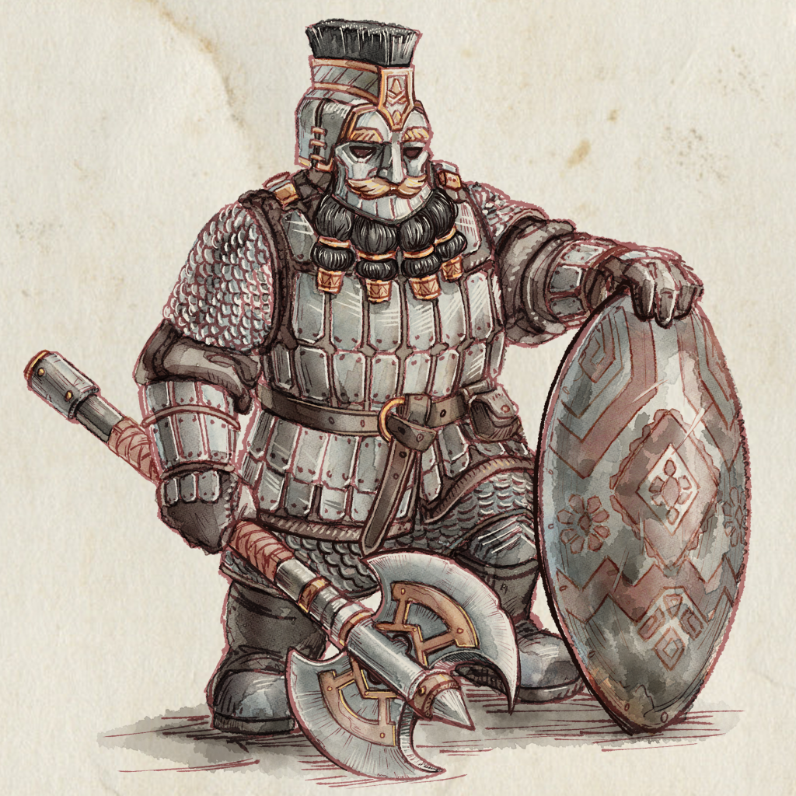

## Building an Army
The first step to playing a game of SOVL is to build and army. Start by choosing one of the factions available. Then select a character to lead your army. A stubborn Dwarf Foreman or a savage Orc Warchief? Then fill out the rest of your points alotment with units and their equipment. SOVL can be played at different point sizes:

|:-----|:-----|
|**Warband**| 500 pts |
|**Battalion**| 1000 pts |
|**Legion**| 1500 pts |

Full details for how to build your amy can be found in the [Faction Source documents](FactionSource)!

## Gameplay
SOVL is played on a table with miniatures representing individual soldiers. Dice are used to determine the outcomes of combat, magic and many other mechanics that can occur during a game. 

Players begin by setting up the table with terrain, deploying their armies and determining who goes first. This part of the game is called Setup and Deplyment and more detailed rules for it can be found [here](SetupAndDeplyment). 

The game then plays out over several Rounds. Each Round is divide into 3 Phases, [Charge](ChargePhase), [Strategic](StrategicPhase) and [Combat](CombatPhase). Players take turns activating units and performing actions like moving, charging or firing missile weapons. Full details on the Round Loop and the 3 Phases can be found [here](GameLoop). 

## Alternating Activations
In both the Charge and Strategic Phase players get to activate units and perform some action. This is done using Alternating Activations. After a player has fininshed an activation the active player changes and his or her opponent gets the oppotunity to activate a unit. 

## Objective of the game

----
