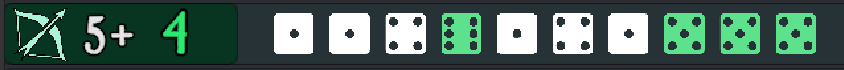

<link rel="stylesheet" href="../style.css">

## Building an Army
The first step to playing a game of SOVL is building an army. Start by choosing one of the [Factions] available. Then select a **Commander** to lead your army. A stubborn Dwarf Foreman or a savage Orc Warchief? Then fill out the rest of your points allotment with units and their equipment.

## Gameplay
SOVL is played on a table with miniatures representing individual soldiers. Dice are used to determine the outcomes of combat, magic and many other mechanics that can occur during a game. 

Players begin by setting up the table with terrain, deploying their armies, and determining who goes first. This part of the game is called Setup and Deployment and more detailed rules for it can be found [here](SetupAndDeplyment). 

The game then plays out over several Rounds. Each Round is divided into 3 Phases, [Charge](ChargePhase), [Strategic](StrategicPhase), and [Combat](CombatPhase). Players take turns activating units and performing actions like moving, charging, or firing missile weapons. Full details on the Game Loop and the 3 Phases can be found [here](GameLoop). 

## Objective of the game
SOVL can be played using many different scenarios and victory conditions. The game continues until all units from one side are either destroyed or fleeing. If this hasn't happened by the end of turn 8 (or some other agreed-upon limit), the game ends immediately and the outcome is resolved by score. Details on how to score a game can be found [here](EndOfGame). 

## Rolling Dice
The outcome of many actions in SOVL are determined by rolling dice. Usually this means rolling one or more six sided dice (d6), trying to beat a target number. For an **Attack Roll** of **4+** to hit, results on the die of 4 or higher are succesful (hits), and 3 or lower are failures (misses).

Ten Goblin Archers make a Ranged Atack of 5+. They roll ten d6 dice and results of 5 or higher are succeful hits! 

  
  

----

[factions]: FactionSource/FactionSource