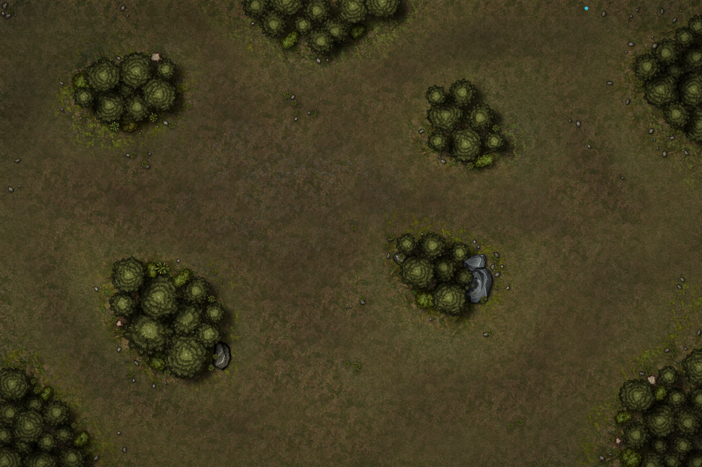

## Setting up the table
SOVL can be played on any playing surface, usually a table. The standard dimensions (used in the digital version) are as follows:

|:------|:-----|
|**Standard**| 40x60" |
|**Large**| 48x72" |

To make an interesting playing surface the table should be set up with various terrain pieces. There are no hard rules for how many terrain pieces to use or how much of the table should be covered. Around 3-6 pieces while also leaving enough room to maneveur units is usually a good number.

## Terrain Types

Different types of terrain have different impacts on the battlefield.

### Difficult Terrain
 Some terrain like forests and swamps can be traversed by units but slow them down. These are classified as Difficult Terrain. Any unit that enters or starts its turn inside Difficult Terrain reduces its movement by 25%.

### Line of Sight

 Terrain like forests, cliffs or buildings are tall enough to block line of sight from most units. This stops units from charging or firing missile weapons at targets hidden by these terrain features.

|:------|:-----|
|**Forest**| Difficult Terrain, blocks LOS |
|**Cliff**| Impassable, blocks LOS  |
|**Building**| Impassable, blocks LOS  |
|**River/Lake**| Impassable |
|**Swamp**| Difficult Terrain |

## Deployment

## Determining starting initiative

----