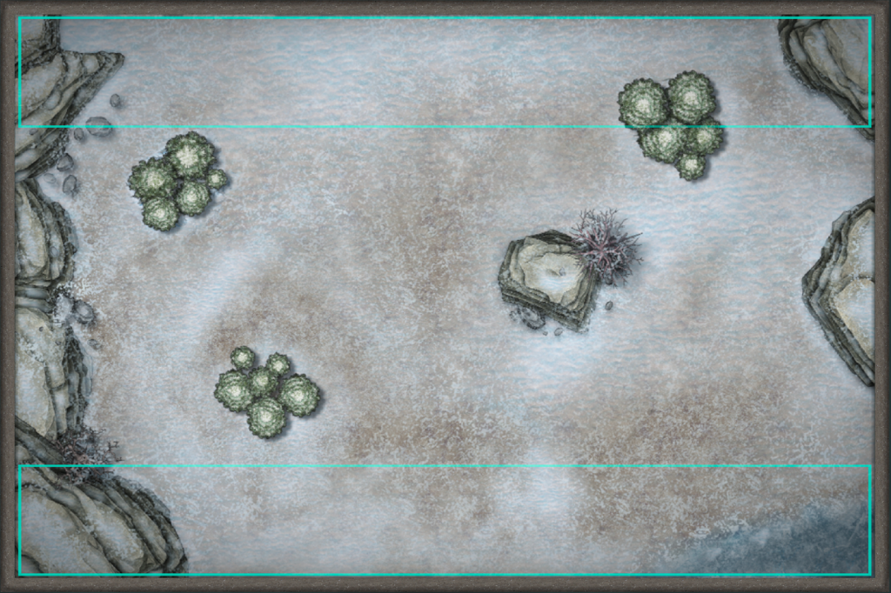

## Setting up the table
SOVL can be played on any playing surface, usually a table. The standard dimensions (used in the digital version) are as follows:

|:------|:-----|
|**Standard**| 40x60" |
|**Large**| 48x72" |

To make an interesting playing surface the table should be set up with some terrain features. There are no hard rules for how many featues to use or how much of the table should be covered. Around 4-8 pieces while also leaving enough room to maneveur is usually a good number.

## Terrain Types

Different types of terrain have different impacts on the battlefield.

Solid terrain like cliffs and buildings are **Impassable** and block movement completely.

Some features like forests and swamps can be traversed, but slow down movement. Any unit that enters or starts its turn inside **Difficult Terrain** reduces its movement by 25%. If a unit has less than 25% of its movement allowance left its not allowed to enter difficult terrain.

Terrain features like forests, cliffs and buildings are tall enough to block **Line of Sight** for most units. Line of sight is needed to declare charges, use missile weapons and for casting some spells.

|:------|:-----|
|**Forest**| Difficult Terrain, blocks LOS |
|**Cliff**| Impassable, blocks LOS  |
|**Building**| Impassable, blocks LOS  |
|**River/Lake**| Impassable |
|**Swamp**| Difficult Terrain |

## Deployment Zones

In a regular game of SOVL the playing surface has 2 deployment zones laid out along the sides of the table. On a Standard table (40" across) the deployment zones are 8" deep, leaving 24" between them. When players deploy their units they have to be placed fully within their owners deployment zone!

After terrain placement both players roll 1d6. The player with the highest roll (re-roll ties) picks from the following:

1. **Choice of deployment zone**. Choose wich side to deploy your units on.
2. **Choice of starting initiative**. Choose which player is the active player when the game starts.

The player with the lower result gets the remaining choice.

## Deployment

There are two ways to deploy units in SOVL, Simultaneous and Alternating deployment.  

**Simultaneous deplyoment** is used in the digital version of the game. It can also be used when playing with miniatures if you have a screen that blocks the view of the opponents deployment zone.

Both players deploy their entire army simultaneously, without any knowledge of the opponents positions. This deployment method is fast but can be less strategic.

**Alternating Deployment** instead has both players take turns deploying a single unit, with the player who made the choice of deployment zone going first. When one player runs out the other player continues until all units are on the table. 

----