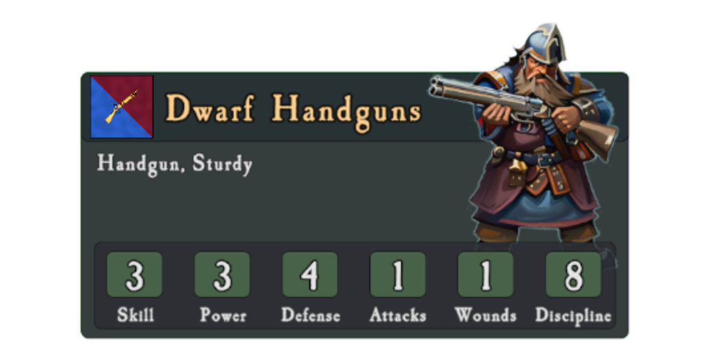

<link rel="stylesheet" href="../style.css">

Armies consist of units of soldiers with varying stats and abilities. A units fighting capabilities are described by it's Stat Block, Equipment and Properties.

## The Stat Block
Each unit has a list of stats that describe how good it is at various things.

|:---|:----------|
|**Skill**| A units `Skill` is a measure of the units training and general fighting ability. It is used to determine Hit Chance in combat and also for Ranged Attacks. |
|**Power**| **Power** describes a units physical strength and hitting power. It's used in combat to overcome the defenders Defense stat. |
|**Defense**| **Defense** is a combination of the units general toughness and armor. It's used to determine the units  Damage Save against incoming hits. |
|**Attacks**| A units **Attacks** stat is used to determine how many attacks each model gets to make in combat. |
|**Wounds**| The **Wounds** stat tells us how many points of damage each model in a unit can take before it is removed. |
|**Discipline**| **Discipline** is a measure of the units bravery and tendency to stick around when things look grim. It's used for Discipline tests after combat and heavy casualties. |

## Unit Types
Units come in different types which determines some basic properties.

| Unit Type | Base Size | Movement Rate |Description |
|:-----|:----|:---|:----------|
|**Infantry** | **20x20**| 8 | Basic infantry with a standard base size |
|**Infantry** | **25x25**| 8 | Basic infantry with a bigger base size |
|**Cavalry** | **25x50**| 16 | Cavalry like Imperial Knights or Wolf Riders |
|**Monstrous Infantry** | **40x40**| 12 | Bigger infantry units like Trolls or Minotaurs |
|**Large Monster** | **50x50**| 12 | Huge monsters like Giants |
|**Chariot** | **50x100**| 16 | Wheeled chariots |

## Characters

----