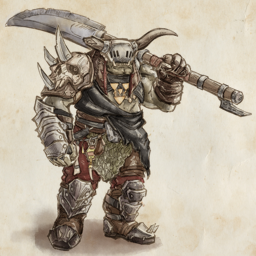

SOVL is a ruleset for playing fantasy wargames. It can be played with miniatures on a table or digitaly on Steam. Armies made up of humans or fantasy creatures like Orcs or Dwarves meet on the battlefield and fight until one side is the bloody victor. Units of miniatures are moved around on the table and the outcome of melee combat, volleys of arrows or destructive magical spells is decided with dice rolls.

----

[use this template]: https://github.com/just-the-docs/just-the-docs-template/generate
