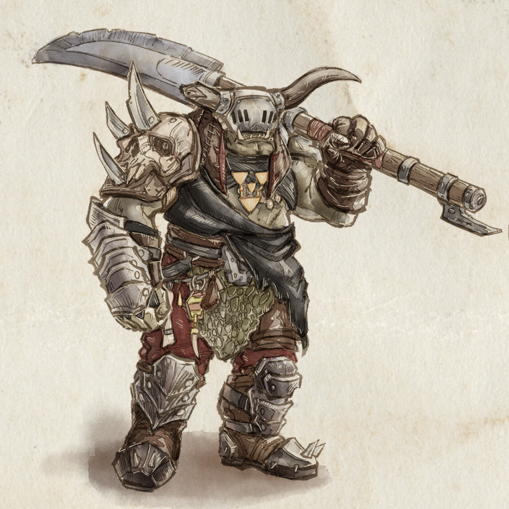

<link rel="stylesheet" href="style.css">

SOVL is a ruleset for playing fantasy wargames. It's played with miniatures on a table or [digitally on Steam]. 

Armies made up of humans or fantasy creatures fight on the battlefield until one side is victorious. Units of soldiers maneuver on the table and the outcome of melee combat, volleys of arrows, and destructive magic is decided with dice rolls.

This document has all the rules needed to [play the game].

 

 
 

----

[digitally on Steam]: https://store.steampowered.com/app/1870300/SOVL
[play the game]: docs/PlayingTheGame
